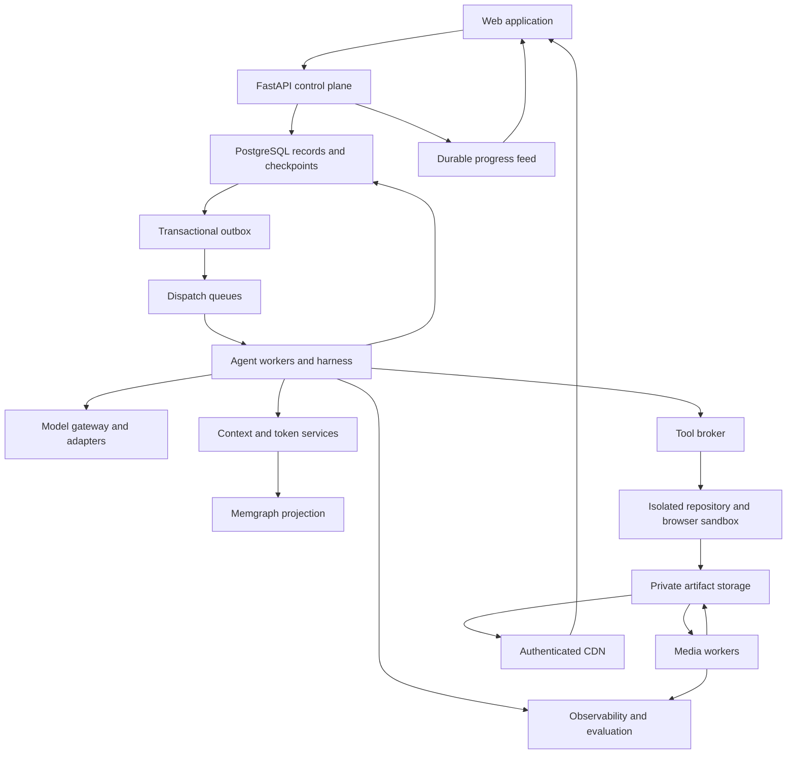
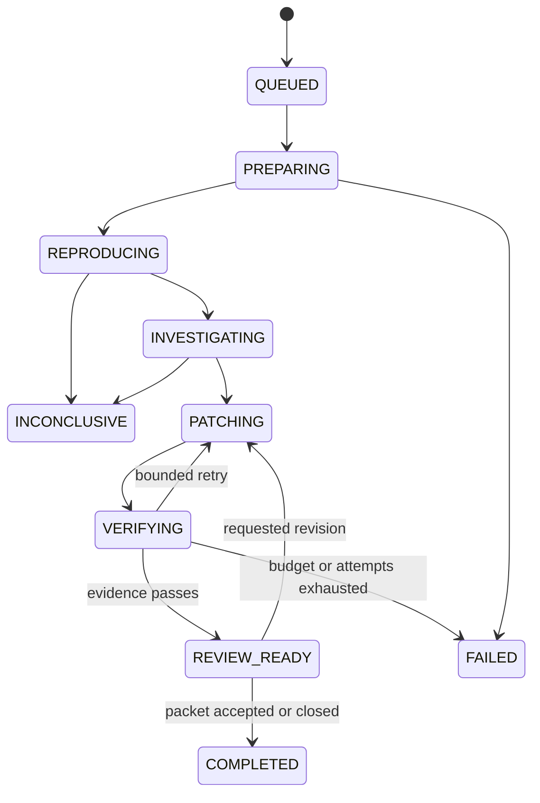
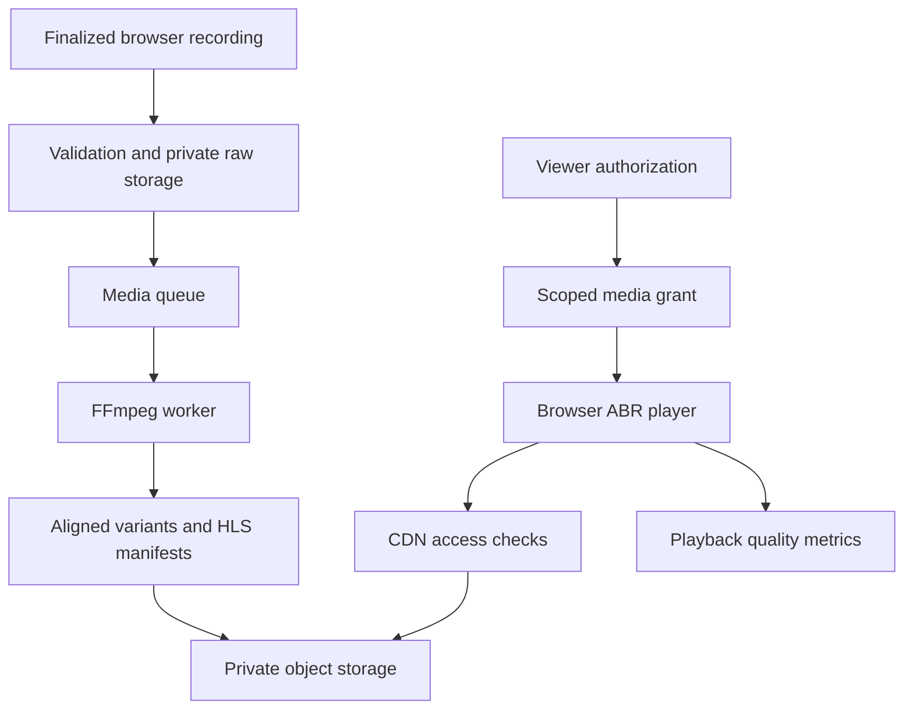

# AI Engineering Platform Product Requirements and Architecture

Version 1.0 | 1 October 2026 | Owner Jashwanth Reddy | Status Proposed implementation baseline

This document is the single source of truth for an AI engineering platform that investigates web application bugs, edits code in isolated workspaces, verifies proposed repairs and presents evidence for human review. It defines the product, infrastructure, model and tool plugins, agent harness, context and token management, persistent memory, browser automation, adaptive video delivery, evaluation and operations. The first release focuses on browser reproducible bugs in a controlled application stack; the platform boundaries support broader coding tasks later.

The recommended design is a modular FastAPI control plane with independent agent, sandbox and media workers. PostgreSQL owns application records and durable execution state. Memgraph provides a derived graph of connected project knowledge. Provider adapters support OpenAI GPT 5.6, Claude Sonnet and Gemini through their native APIs. Browser recordings are delivered through an authenticated adaptive streaming pipeline and CDN. No vector database is required for the initial release.

All numerical limits, schedules and service objectives below are proposed engineering targets, not measured results or contractual promises. Provider availability and prices must be verified for the deployment account. Sources describe documented capabilities; architecture choices and defaults are recommendations for this product.

Read Sections 2 through 6 first for product scope and architecture, Sections 8 through 15 for the agent runtime and media design, and Sections 21 through 27 for qualification and delivery. The contracts and acceptance scenarios are implementation instructions; the source register distinguishes documented vendor capabilities from this platform's design decisions.

### Contents

1. [Document authority and change control](#1-document-authority-and-change-control)
2. [Product purpose and users](#2-product-purpose-and-users)
3. [Scope and release boundaries](#3-scope-and-release-boundaries)
4. [End to end user journeys](#4-end-to-end-user-journeys)
5. [Architecture decisions and alternatives](#5-architecture-decisions-and-alternatives)
6. [Logical architecture](#6-logical-architecture)
7. [Deployment infrastructure](#7-deployment-infrastructure)
8. [Model provider plugins](#8-model-provider-plugins)
9. [Tool plugins and external integrations](#9-tool-plugins-and-external-integrations)
10. [Agent harness and orchestration](#10-agent-harness-and-orchestration)
11. [Context and token management](#11-context-and-token-management)
12. [Persistent memory and graph retrieval](#12-persistent-memory-and-graph-retrieval)
13. [Sandbox and browser execution](#13-sandbox-and-browser-execution)
14. [Repair correctness and review](#14-repair-correctness-and-review)
15. [Adaptive bitrate media and CDN](#15-adaptive-bitrate-media-and-cdn)
16. [Data model and persistence](#16-data-model-and-persistence)
17. [API and streaming contracts](#17-api-and-streaming-contracts)
18. [User experience and administration](#18-user-experience-and-administration)
19. [Security and data governance](#19-security-and-data-governance)
20. [Observability and operations](#20-observability-and-operations)
21. [Evaluation and model qualification](#21-evaluation-and-model-qualification)
22. [Reliability and performance objectives](#22-reliability-and-performance-objectives)
23. [Cost model and economic controls](#23-cost-model-and-economic-controls)
24. [Configuration and internal contracts](#24-configuration-and-internal-contracts)
25. [Repository layout and engineering conventions](#25-repository-layout-and-engineering-conventions)
26. [Delivery plan and implementation dependencies](#26-delivery-plan-and-implementation-dependencies)
27. [Acceptance criteria and traceability](#27-acceptance-criteria-and-traceability)
28. [Risks and design limitations](#28-risks-and-design-limitations)
29. [Final design decisions and unresolved validation work](#29-final-design-decisions-and-unresolved-validation-work)
30. [Source register](#30-source-register)
31. [Glossary](#31-glossary)
32. [Change log](#32-change-log)

## 1 Document authority and change control

MUST denotes a release requirement. SHOULD denotes a recommended default whose exception requires a recorded reason. MAY denotes an extension. P0 is required for the first useful vertical slice; P1 is required before the paid team pilot; P2 is an expansion after pilot evidence.

This file governs product behavior, interfaces and engineering defaults. Implementation code, configuration, migrations, tests and deployment manifests must reference the applicable requirement IDs. The implementation should produce an OpenAPI schema and validated configuration schema, but these generated artifacts cannot silently change the decisions here. If implementation or provider constraints differ, update this document and its change log together with the code. Do not maintain competing PRDs.

Every run pins the PRD version, workflow version, prompt bundle hash, policy version, plugin versions, model registry revision, target repository commit and sandbox image digest. A changed model alias does not count as a reproducible model snapshot; record the resolved model identity where a provider exposes it.

Assumptions adopted for this baseline:

- The initial customer is a small engineering or QA team working on a web application it owns or is authorized to test.
- The demonstration target is a FastAPI backend and React or Next.js frontend. Trickee may be used as an authorized demo target without assuming any existing defect.
- GitHub is the first repository integration; the platform supports one repository per task initially.
- The team can use hosted model APIs and a managed cloud account. API credentials are not yet supplied, and this PRD does not provision paid infrastructure.
- AWS is the production reference cloud. Storage, queue and sandbox contracts remain replaceable.
- The first hosted release runs in one region with multi availability zone control services. It does not attempt Netflix scale.
- Memgraph is the selected graph database. It is not an automatically complete memory system; memory construction, verification, retrieval and deletion are application responsibilities.
- PageIndex is an optional document retrieval plugin, not a replacement for run checkpoints or connected project memory.

Decision order: authorization and security constraints, required task correctness, reproducibility, reliability, latency and then cost optimization. Cost limits can pause a task but cannot relax tool permissions or truthfulness.

## 2 Product purpose and users

The product converts a bug report into a reproducible diagnosis, a candidate patch, independent validation and a review packet. It reduces the work between receiving a report and having evidence that a proposed fix resolves it. It must explicitly report inconclusive investigations and failed repairs.

| User | Job to be done | Product result |
|---|---|---|
| Developer | Investigate a reported failure without repeatedly collecting evidence | Reproduction steps, linked files, candidate cause and patch |
| QA engineer | Confirm a reported issue and check a repair | Repeatable browser scenario and before and after evidence |
| Technical lead | Review correctness, scope and risk | Diff, independent test results, limitations and action approvals |
| Agency engineer | Resume work across client projects and sessions | Tenant isolated project memory and recoverable runs |
| Organization administrator | Control data exposure, spend and plugins | Model policy, credentials, audit log, quotas and retention |

Primary success measure: reviewer accepted, independently validated repairs divided by all eligible benchmark tasks attempted. A repair is eligible only when the repository and test environment can be prepared under the declared support matrix. The report must also show success across all submitted tasks so excluding difficult tasks cannot inflate results.

Pilot business hypothesis: teams spend less engineer time reproducing and preparing reviewable fixes. Measure time saved against a recorded manual baseline; do not advertise an unmeasured reduction. The platform differentiates through verifiable browser evidence, connected memory and resumable execution, rather than through the number of agents invoked.

## 3 Scope and release boundaries

### 3.1 First vertical slice P0

The platform accepts a report, repository reference, base commit, test URL and optional fixture. It prepares a known application environment, reproduces a form or API failure through Playwright, inspects scoped code and logs, proposes a patch, runs tests and produces a downloadable review packet. A chat interface shows durable progress events. The user can select any installed, validated model provider adapter. Provider adapters for OpenAI, Anthropic and Google are P0, although a user without a provider credential cannot execute that provider.

P0 includes session continuity, PostgreSQL checkpoints, bounded context, token and currency budgets, Memgraph retrieval with provenance, a sandbox boundary, cancellation, policy enforcement, one seeded regression suite and browser recordings. Initial video playback may use a private MP4 while the independent P1 ABR pipeline is being completed; this is clearly labelled as incomplete ABR support.

### 3.2 Team pilot P1

P1 adds real tenant isolation, scoped repository credentials, draft PR publication after approval, production sandbox isolation, model plugin administration, allowlisted MCP integration, optional CrewAI specialist review, versioned memory feedback, authenticated HLS playback and CDN, evaluation dashboards, retention, restore drills and provider outage handling. All P1 acceptance gates must pass before handling paid customer repositories.

### 3.3 Expansion P2

P2 adds generalized code implementation tasks, additional application stacks, multiple repositories, optional PageIndex document tools, live interactive browser viewing, enterprise identity, private model endpoints, richer graph extraction and additional source control providers. Each expansion reuses the same contracts and obtains its own threat and evaluation review.

### 3.4 Explicit exclusions

The first releases do not train foundation models, claim perfect autonomous repair, automatically deploy to customer production, execute arbitrary third party plugins in the API process, crawl unrelated websites, expose arbitrary Cypher or SQL to agents, or rebuild Netflix's global CDN. Native mobile development and real production payment or destructive customer database operations are outside the supported task set. General chat and media consumption are supporting interfaces rather than separate consumer products.

## 4 End to end user journeys

### 4.1 Report to review packet

1. The user creates a project, connects an authorized repository and configures a test deployment or reproducible local fixture.
2. The UI checks plugin readiness, model availability, repository permissions, quotas and supported stack before accepting execution.
3. The user submits a report with expected and actual behavior, reproduction inputs and task budget. The system uploads attachments to a quarantined area before validation.
4. FastAPI stores the task, run, policy snapshot and dispatch outbox record in one PostgreSQL transaction. A repeated idempotency key returns the original run.
5. An agent worker acquires a fenced run lease, prepares an isolated workspace at the pinned commit and starts the LangGraph workflow.
6. The agent reproduces the failure using browser tools and records screenshots, a video, requests and sanitized logs. If reproduction fails, it requests missing task information or returns an inconclusive report rather than inventing a defect.
7. The context service combines current evidence, repository search and scoped graph memory. A model proposes hypotheses; tools test those hypotheses before a candidate cause is labelled supported.
8. The repair agent edits an isolated branch. The workflow records a patch and adds or proposes a regression test.
9. A verification stage runs the baseline and regression tests at the exact patched tree, repeats the browser scenario and checks for unrelated changes.
10. Optional specialist review is bounded and advisory. It cannot override failed tests or policy denials.
11. The UI displays the review packet. The user can request another iteration, download the patch or approve publishing a draft PR.
12. Verified facts and review outcomes enter project memory. Independent media workers finish adaptive video encodes; their completion updates the packet without changing the code verification verdict.

### 4.2 Session recovery

The user leaves midway and returns later. The conversation and durable run status reload. A running task remains attached to its original project, budget and commit. If the worker failed, recovery restores a checkpoint and reconciles recorded tool effects before repeating anything. If the repository moved, the task remains pinned; a new run is required to validate the newer commit.

### 4.3 Controlled model switch

The user selects another approved provider. The system creates a model boundary at a checkpoint with no unresolved tool call. It carries the public task state, evidence and summaries forward, not provider private reasoning. It checks capabilities and data policy, creates a new provider conversation lineage and records the reason. The user sees the switch and its budget implications. A provider outage must never cause unannounced disclosure to another provider.

### 4.4 Evidence review on a slow connection

A reviewer opens a before and after recording. The application authorizes the exact artifact and issues short lived media access. The player requests HLS segments through the CDN and adapts among encoded variants. Screenshots and a text timeline remain available when lower resolution makes small code or error text unreadable. Video failure does not hide a failed test or change a patch verdict.

## 5 Architecture decisions and alternatives

| Decision | Selected approach | Reason and alternative |
|---|---|---|
| Application structure | Modular FastAPI service plus separate workers | Simple initial ownership and clear isolation; many microservices add operational cost too early |
| Main workflow | LangGraph with PostgreSQL persistence | Stateful agent execution and resumability; no second overlapping workflow owner |
| Specialist agents | CrewAI as an optional bounded LangGraph task | Satisfies specialist collaboration while avoiding nested uncontrolled orchestration |
| Connected retrieval | Memgraph with application governed graph memory | Fits incidents and code relationships; PageIndex is better suited to document sections |
| Authoritative storage | PostgreSQL with graph projection | Transactional records and recoverable graph rebuilding |
| Provider integration | Native API adapters behind one capability aware contract | Preserves provider semantics; an optional gateway can later replace transport without owning authorization |
| Dispatch | SQS with database leases and transactional outbox | Durable work distribution; queue delivery is not execution state |
| Cache | Redis or compatible managed cache | Disposable acceleration and rate limits; never sole execution truth |
| Sandbox | Per run isolated VM for hosted untrusted code | Clear boundary; plain containers alone are insufficient for hostile repositories |
| Artifact delivery | Private S3 and CloudFront | Separates media bandwidth from FastAPI; local object storage is a development substitute |
| Adaptive video | Offline FFmpeg HLS encoding plus browser ABR player | Appropriate for evidence recordings; live interactive control is a different transport |
| Production scheduler | ECS for trusted API and workers | Managed deployment with fewer moving parts; Kubernetes is an optional later operational choice |

No single stack is best for every load or budget. This reference favors managed control services, explicit sandbox isolation and reversible interfaces. Do not introduce Kafka, Temporal, a service mesh or a vector database until a measured requirement justifies them.

## 6 Logical architecture



The control plane receives commands and authorizes users. The execution plane performs model and tool work. The retrieval plane supplies bounded evidence. The delivery plane serves artifacts. The observation plane measures behavior across all four. There is no required synchronous path from an agent step through the video encoder.

| Layer | Interface and owner | Required behavior |
|---|---|---|
| Frontend | Versioned REST, SSE and browser player | Clear status, review diff, model choice and resumable events |
| Control API | FastAPI modules | Authentication, scoped authorization, validation and command persistence |
| Job admission | Quota and budget service | Reserve spend and run capacity before dispatch |
| Workflow | LangGraph runner | Pin state and transitions; checkpoint durable boundaries |
| Harness | Execution policy interface | Enforce limits, handle failure and reconcile effects |
| Model gateway | ProviderAdapter contract | Normalize requests and events while retaining provider metadata |
| Context service | ContextBundle contract | Select and cite fresh evidence under a budget |
| Token service | TokenPlan and usage ledger | Count, reserve, compact and reconcile charges |
| Memory service | Scoped read and proposed write tools | Verify provenance, freshness and project membership |
| Tool broker | Registered JSON schema tools | Validate, authorize and execute in the right isolation domain |
| Plugin registry | Signed or approved version manifest | Validate compatibility, permissions and lifecycle |
| Media service | MediaJob contract | Encode validated recordings and publish artifacts atomically |
| Evaluation | Benchmark manifest and result schema | Evaluate code, retrieval, safety and recovery |
| Telemetry | OpenTelemetry and audit events | Trace without exposing raw sensitive payloads |

## 7 Deployment infrastructure

### 7.1 Local development

Use Docker Compose for trusted development services: FastAPI, frontend, PostgreSQL, Memgraph, Redis, an S3 compatible object store and an optional local queue adapter. Agent and media processes are separate services. Playwright runs in a development container with synthetic repositories and data only. This local container mode is explicitly not the production security boundary. No real tenant or production credentials enter it.

A local queue adapter must pass the same duplicate dispatch and crash recovery tests as SQS. It may be simpler operationally, but its semantics cannot change the run ledger. FFmpeg is a media worker dependency; no GPU is needed for the default short evidence recordings. Model calls use configured hosted APIs; a self hosted model adapter is optional.

### 7.2 Hosted pilot reference

Use one AWS region selected for user latency and required residency, provisioned through Terraform. Place public load balancing at the edge; API, worker, database and memory services use private subnets with narrowly scoped network rules.

| Service | Deployment reference | Starting capacity assumption |
|---|---|---|
| Frontend | Static assets on S3 and CloudFront; ECS service if server rendering is required | Separate public static cache behavior |
| API | Two ECS tasks behind a load balancer across two zones | Start at 1 vCPU and 2 GiB each; resize from measurements |
| Agent coordinator | ECS workers using queue depth and active run limits | Two tasks; actual run concurrency constrained by provider and sandbox quotas |
| Sandbox | Broker provisions a dedicated ephemeral VM per run | Start with 2 vCPU, 4 to 8 GiB and bounded disk |
| PostgreSQL | Managed RDS PostgreSQL with backups and multi zone availability for paid pilot | Size from active connections and event volume |
| Memgraph | Dedicated private compute with persistent storage | Start with 4 vCPU and 16 GiB; memory benchmark is mandatory |
| Redis | Managed cache | No authoritative records; graceful cache loss |
| Dispatch | SQS standard queues and DLQs | Separate agent, media and projection queues |
| Artifacts | Private S3 with encryption, checksums and lifecycle | Object paths include tenant and project identifiers |
| Media worker | Separate ECS worker pool | Start with 2 to 4 vCPU; enforce encoder concurrency |
| CDN | CloudFront with private media behavior | Authorize all media objects, including segments |
| Secrets | Secrets Manager and KMS | Workload roles, secret references and rotation |
| Telemetry | OpenTelemetry collector and chosen metrics, log and trace backend | Sampling plus durable action audit |

These sizes are planning defaults rather than throughput guarantees. Start with an active run cap of ten and measure before raising it. A Memgraph outage degrades graph retrieval; authoritative records remain in PostgreSQL and the graph can be rebuilt. Do not claim Memgraph high availability until its exact version, license, topology and failover behavior are validated. The pilot prioritizes recoverability over unverified clustering claims.

### 7.3 Production growth

Scale API tasks from request latency and connections; agent workers from runnable tasks, not paused sessions; media workers from oldest job age; sandbox capacity from admitted runs. Reserve tenant concurrency to prevent one organization occupying all workers. Pause admission when model limits or sandbox capacity are exhausted and return a queue estimate.

Multi region active active execution is deferred. A later design needs single writer ownership per run, replicated artifacts, residency aware model routing and tested conflict handling. Until then, maintain a documented restore region and a reproducible infrastructure plan.

## 8 Model provider plugins

### 8.1 Required providers and model registry

FR-MOD-01 P0: OpenAI, Anthropic and Google adapters MUST implement the normalized provider contract and conformance suite. The user can choose an administrator enabled model. All choices remain subject to capability, data residency, budget and tenant policy.

An optional P2 private endpoint adapter can support a self hosted model behind a capability qualified API. An OpenAI compatible URL is not evidence that tool streaming, structured outputs, token accounting or multimodal inputs behave identically. Model weights, tokenizer, inference server, GPU class and quantization must be versioned and benchmarked. Hosted API adapters require no local inference GPU; self hosting has a separate compute and capacity budget.

| Provider | Initial documented model example | Native interface reference | Validation obligation |
|---|---|---|---|
| OpenAI | GPT 5.6 Sol with model ID `gpt-5.6-sol` | Responses API | Tool streaming, function outputs, reasoning continuation items and usage |
| Anthropic | Claude Sonnet 5.5 with model ID `claude-sonnet-5-5` | Messages API | Tool use and result blocks, thinking metadata, stop reasons and usage |
| Google | Gemini 3.8 Flash with model ID `gemini-3.8-flash` | Interactions API for the current default interface | Function events, continuation state, signatures if applicable and usage |

These model IDs were documented in official provider pages checked on 1 October 2026 [S01, S03, S05, S06]. They are examples, not automatic production defaults or promises of account access. The user requested GPT 5.6 support; it is preserved even if newer models exist. Use a tested snapshot where offered. Run a credential and capability probe before enabling a model. A failed or unsupported model remains disabled with an explanatory status.

FR-MOD-02 P0: A versioned registry MUST include provider, API family, model ID, resolved snapshot, verified context and output limits, input modalities, supported tool and structured output features, tokenizer strategy, reasoning configuration, rate limits, region restrictions, price rules, effective date and validation state. Unknown limits cause admission failure rather than assuming a large context window.

The common interface does not expose provider specific reasoning knobs as if they were equivalent. Display only controls the selected model supports, with a mapping recorded in the adapter. Do not send unsupported sampling fields to reasoning models.

### 8.2 Provider adapter contract

```python
class ProviderAdapter(Protocol):
    async def validate(self, registry_entry, credential_ref) -> CapabilityReport: ...
    async def count_input(self, request) -> TokenEstimate: ...
    async def stream(self, request) -> AsyncIterator[ModelEvent]: ...
    async def cancel(self, provider_request_ref) -> CancellationResult: ...
    def classify_error(self, error) -> ModelError: ...
```

Conceptual contracts are normative at the field level, not runnable application code. ModelRequest includes tenant_id, run_id, step_id, model_registry_revision, role, messages, selected_tool_schemas, output_schema, generation_policy, budget_reservation_id and opaque provider continuation reference. ModelEvent includes text_delta, tool_call_delta, tool_call_complete, usage_update, response_complete, refusal, error and provider_metadata. Every event carries a request reference and monotonic sequence within that request.

FR-MOD-03 P0: Adapter normalization MUST preserve tool call IDs, argument boundaries, stop reasons, provider continuation requirements and usage categories. OpenAI reasoning items needed for a continuing tool cycle, Anthropic protected thinking metadata and Google signatures or continuation artifacts stay in provider scoped encrypted state where applicable. They are not displayed as private chain of thought or rewritten into another provider's messages. Refer to native tool documentation [S02, S04, S07].

FR-MOD-04 P0: Partial streamed tool arguments MUST NOT trigger execution. Execute only a completed, parsed and schema validated tool call authorized by the broker. A disconnected stream with an incomplete call creates a failed model step and no tool action.

### 8.3 Selection and routing

The initial policy supports manual model selection and explicit role assignments. An administrator can nominate planner, coding, verifier and summarizer model entries after benchmark qualification. Use deterministic parsing and filtering in code rather than paying for a model call when no judgment is required.

FR-MOD-05 P1: Automatic routing MUST first filter by tenant data policy, capabilities, context limits and availability, then compare qualified candidates by expected task utility, latency and cost. Do not describe one provider as universally best. A production router needs evidence from this platform's task distribution, not a vendor benchmark alone.

FR-MOD-06 P1: Cross provider failover MUST require preconfigured tenant authorization. If no approved alternate exists, pause or fail transparently. Do not route sensitive repository content to a new provider because the default is rate limited. Switching occurs only at a completed tool boundary and creates a new lineage with a portable context bundle.

### 8.4 Credential and billing model

Support platform managed credentials first. P1 MAY add bring your own key, stored as an encrypted secret reference scoped to the tenant. Keys are never returned to the frontend, model prompts, browser sandbox or plugin manifests. Account subscription access does not imply API access or API credits.

Model calls use native SDKs or HTTP clients with explicit timeouts and retries. A future shared gateway such as a compatible third party proxy must pass the same conformance suite; it cannot own tool execution policy. Distinguish invalid credentials, inaccessible model, rate limit, timeout, overload, safety refusal, invalid schema and context overflow.

### 8.5 Model plugin lifecycle

FR-MOD-07 P1: Installation moves through registered, validating, qualified, enabled, deprecated and disabled states. A new adapter version or model alias change triggers qualification. Keep active runs on their pinned revision unless an emergency security disable requires a visible pause. Record all model changes in the audit log.

Conformance tests cover text streaming, vision input where supported, two sequential tool cycles, parallel proposed calls, malformed arguments, refusal, interrupted stream, unsupported option rejection, token estimation calibration, cost reconciliation and provider switch. A provider's hidden reasoning cannot be asserted equivalent across models.

## 9 Tool plugins and external integrations

### 9.1 Manifest and boundaries

FR-PLG-01 P1: Every plugin MUST declare plugin_id, version, contract_version, publisher, artifact digest, transport, tool names, JSON schemas, permission scopes, allowed network destinations, credential types, maximum runtime, output size, side effect class and compatibility constraints. Pin exact versions. Model output may request a tool but cannot install a plugin or enlarge its permissions.

Plugin categories are model providers, repository integration, browser, execution, retrieval, media and external knowledge tools. Different categories have different trust boundaries. Provider and internal adapters run as reviewed control code. External tool plugins execute in isolated workers or remote endpoints. Imported source code never runs in FastAPI.

FR-PLG-02 P1: MCP servers MUST be administrator allowlisted and registered with reviewed tool manifests. Treat tool descriptions and results as untrusted data. Reject unauthorized endpoint changes and enforce credential audience and host restrictions. Server discovery does not authorize execution. MCP security guidance is a source for integration review [S16].

### 9.2 Initial tool catalog

| Tool family | Initial operations | Default authority |
|---|---|---|
| Repository | list files, search text, read scoped files, inspect diff | Read pinned workspace |
| Editing | apply patch, create task files | Write isolated run workspace |
| Test execution | run named test target, collect exit status | Run approved commands in sandbox |
| Browser | navigate, inspect DOM, click, fill, screenshot | Test origins and fixture identities only |
| Evidence | read sanitized request log, retrieve artifact excerpt | Current project and run |
| Memory | retrieve connected facts, propose memory write | Scoped read; writes validated by service |
| Repository publication | push task branch, create or update draft PR | Explicit action approval plus integration permission |
| Documentation P2 | PageIndex retrieve document sections | Authorized document collection |

Browser element references expire after navigation or meaningful page change. The tool must reacquire page state before a stale action. Prefer semantic locators; use screenshot based coordinates only when necessary and capture the resulting state.

FR-PLG-03 P0: ToolResult MUST carry status, sanitized summary, artifact references, structured fields, retryability, duration, byte count, source version and side_effect_receipt. Truncation is explicit and full output remains available as an authorized artifact. A successful HTTP call is not evidence that a user workflow or code test succeeded.

## 10 Agent harness and orchestration

### 10.1 Workflow ownership

FR-HAR-01 P0: LangGraph owns the main task state. FastAPI admits work; a worker invokes the workflow under a run lease. The harness mediates every model and tool call. CrewAI can execute one bounded review task returning a structured result; it does not own the run queue, global retry loop or canonical memory. No specialist can publish a PR or access tools outside its delegated scope.

CrewAI's collaborative task abstraction is documented in its crews reference [S09]; the bounded delegation and shared budget policy here are application requirements. Enabling a CrewAI review never implicitly enables an embedding based memory backend or a vector store. It receives the same explicit ContextBundle and memory tools as any other specialist.

LangGraph's documented persistence distinguishes thread scoped checkpoints from long term stores [S08]. Use a persistent PostgreSQL checkpointer; an in memory checkpointer is limited to unit tests. Memgraph is accessed by the memory service and does not replace workflow checkpoints.



PAUSED_INPUT, PAUSED_APPROVAL, PAUSED_BUDGET, RECOVERING and CANCEL_REQUESTED are controlled interruption states reachable from active states. Their resume_target is stored separately. Terminal states are COMPLETED, INCONCLUSIVE, FAILED and CANCELLED. REVIEW_READY is not terminal because revision remains possible. The review packet's verification_status is independent of the user's acceptance decision and media_status.

### 10.2 Bounded execution defaults

FR-HAR-02 P0: Standard tasks allow at most 40 total model calls, 80 tool calls, three patch attempts, two infrastructure retries per safe step and 30 minutes active execution. Browser navigation defaults to 30 seconds, single model response to 180 seconds and a named test command to 300 seconds. Longer values require an explicit policy profile. All provider calls, including summarization and specialist review, consume the same run ledger.

Read only independent tools MAY run in parallel up to four calls. Workspace writes serialize. Test steps can parallelize only with isolated fixtures. Repeat loop detection compares normalized action signatures and state progress; three identical no progress actions pause the run with evidence. A repeated failure is not grounds to weaken a guardrail.

FR-HAR-03 P0: Paused runs release worker and sandbox capacity after snapshotting necessary artifacts. Approval has a default 24 hour expiry and consumes no continued model calls. Sandbox recovery may need reprovisioning; do not promise a live browser survives every pause. Resume reapplies the original policy or a stricter current policy, validates snapshot checksums and reconciles effects.

### 10.3 Reliable execution and side effects

The queue provides dispatch, not exactly once execution. SQS standard delivery can repeat messages [S13]. PostgreSQL leases, fencing tokens and unique effect keys prevent duplicated committed actions. Queue visibility is extended with a heartbeat during an active dispatch segment [S14]. A paused run acknowledges its dispatch message and requeues through an outbox on authorized resume.

FR-HAR-04 P0: Persist intended effect, tool arguments hash and policy decision before side effect execution. Persist a receipt afterward. Use an effect key derived from tenant, run, workflow step and logical action, not a randomly generated retry ID. Lease owner updates require a matching fencing token. External effects additionally require provider idempotency keys or reconciliation; database fencing alone cannot stop an already issued network request.

A crash after pushing a branch but before storing its receipt is an uncertain effect. Recovery queries the repository for the expected branch commit. A crash after draft PR creation queries the unique task marker and branch. If outcome is still ambiguous, pause for review; do not create another PR blindly. Exactly once outcomes are not guaranteed where the external API lacks a usable reconciliation mechanism.

### 10.4 Cancellation and recovery

FR-HAR-05 P0: Cancellation stops new model and tool calls immediately after the worker observes it, terminates sandbox processes within the grace period and attempts provider cancellation where supported. Record that already issued requests may still finish or incur charges. Retain a partial report and reconcile outstanding billing. A cancellation event cannot be rewritten into success by a late model response.

Workers heartbeat every 10 seconds with a 60 second lease. Recovery excludes a still valid owner and reconciles any STARTED tool action before replay. Prepare deterministic fixture IDs and persist randomness seeds where applicable. Tests that depend on external uncontrolled state are marked nondeterministic and cannot alone qualify a repair.

## 11 Context and token management

### 11.1 Context selection

FR-CTX-01 P0: Each model call receives a ContextBundle with task constraints, permission boundaries, task state, relevant repository excerpts, evidence, selected memory, concise history and the currently authorized tool schemas. Every evidence item has an ID, source locator, version, timestamp, trust label and token estimate. Repository evidence includes commit and file content hash.

Priority order: immutable security and user constraints; active task requirements; current failing evidence; code necessary for the next decision; verified relevant memory; recent messages; older summaries; supplementary documentation. Do not crowd out the actual failure with generic documentation. Label retrieved content as data, not new instructions.

FR-CTX-02 P0: Code retrieval uses scoped file listing, text search and symbol navigation before reading large files. Graph traversal is bounded by project, root entities, relation types, freshness and a default depth of two. Increase depth only with a recorded reason and remaining budget. PageIndex MAY retrieve relevant specification sections in P2; it must return provenance and bounded text like other retrieval tools.

### 11.2 Token budget contract

FR-TOK-01 P0: Token management MUST run before every provider request. Let W be the verified model context limit and A be the application call cap. The usable envelope is min(W, A). It must cover serialized input, provider overhead estimate, requested generation budget including reasoning where the API counts it, and a safety margin. Token categories are provider specific; adapters must not add a separate reasoning reserve when the provider already includes it in output tokens.

For the standard profile, A is 64,000 tokens, generation reservation is up to 8,000 tokens and safety margin is max(2,000 tokens, 5 percent of the envelope). If a model supports less, reduce the envelope and rebalance. If essential constraints cannot fit, fail with CONTEXT_UNSATISFIABLE rather than dropping them.

Example allocation within a 64,000 token envelope:

| Category | Proposed maximum tokens |
|---|---:|
| Instructions and task constraints | 4,000 |
| Selected tool schemas | 4,000 |
| Current task state and recent history | 6,000 |
| Relevant code | 20,000 |
| Current browser and test evidence | 8,000 |
| Retrieved memory and documentation | 6,000 |
| Generation budget | 8,000 |
| Safety margin | 3,200 |
| Remaining slack | 4,800 |

These are caps, not a requirement to fill the window. Actual context is selected for relevance. Image and video inputs require provider modality accounting; text token estimates alone are insufficient. Store estimate method and uncertainty, and reconcile estimates against reported usage to calibrate future margins.

FR-TOK-02 P0: Large DOM snapshots, test logs and tool output MUST be stored externally and passed as structured excerpts with references. Preserve tool call and result pairing. A pending provider tool cycle cannot be compacted into a detached summary.

### 11.3 Compaction and session continuity

FR-CTX-03 P0: Trigger compaction when serialized input reaches 80 percent of its allocated input budget or when the next required result would overflow it. A compaction summary preserves task requirements, source commit, current plan, confirmed facts, competing hypotheses, failed attempts, test results, artifact references, unresolved actions and user decisions. Summary creation consumes run budget and is itself bounded.

Keep immutable constraints in structured fields outside the lossy summary. Save the original transcript and summary lineage. Validate that source references exist and decision fields remain equivalent after compaction. The next call can retrieve original material if a summary is insufficient. Prefer deterministic reduction of logs before using an LLM to summarize.

### 11.4 Spend and admission

FR-TOK-03 P0: Before a call, reserve its upper bound cost from the run and tenant ledger using the model price revision and modality rates. Reconcile the reservation with reported usage afterward. Include cached input, cache writes, output, provider tools, retrieval, specialist agents and uncertain requests. Cached tokens can still be billed. Reasoning tokens must not be double counted.

Default standard run limits: 300,000 cumulative input tokens, 60,000 provider reported billable output tokens and USD 5 authorized model spend. These are independent stop conditions; the first reached pauses the run. Currency budgets include all provider model fees within the run. Infrastructure and media costs are tracked separately with their own quotas. Administrators can define higher profiles, and users must see the chosen limit before execution.

If pricing is unknown, the model is unavailable under a currency constrained policy. If a stream fails without final usage, keep a conservative liability reservation and reconcile later; never book it as free. Refund unused reservation only after the final accounting window or a verified response.

### 11.5 Adaptation inspired by streaming

The context policy MAY vary evidence detail and model role according to task uncertainty, response latency and remaining budget. This is adaptive context management, not video ABR. Network speed cannot justify removing a critical requirement or choosing an unqualified model. Measure correctness and latency together. The true adaptive bitrate layer is defined in Section 15.

## 12 Persistent memory and graph retrieval

### 12.1 Three different kinds of state

Conversation history captures what was said. Execution state captures what the workflow is doing and which effects are committed. Project memory captures verified reusable knowledge. Store and manage these independently; a transcript is not automatically a reliable memory and a graph fact is not a workflow checkpoint.

FR-MEM-01 P0: PostgreSQL owns canonical memory records, their provenance and lifecycle. Memgraph is a query optimized projection of entities and relationships. Memory writes commit canonical records and outbox events together; a projection worker applies them idempotently. If graph retrieval fails, fall back to a bounded canonical lookup and declare degraded retrieval. Never serve a cross tenant or expired cache result as a fallback.

Memgraph's documented GraphRAG architecture supports connected context and source backed retrieval [S20]. This product deliberately uses graph queries and scoped lexical lookup; vendor support for optional vector indexes does not make a vector database mandatory.

### 12.2 Memory types and graph schema

| Memory type | Examples | Required qualifiers |
|---|---|---|
| Project facts | Supported API contract, repository dependency | Repository version and supporting source |
| Episodic records | Incident, attempted fix, verified result | Run, timestamp, outcome and evidence |
| Procedural lessons | Validated reproduction recipe or test command | Applicable stack, environment and successful history |
| User preferences | Preferred report detail or approved model | User scope, consent and update history |
| Decisions | Reviewer accepted a particular approach | Decision maker, rationale and source |

Initial graph labels: Project, Repository, Commit, FileVersion, SymbolVersion, Incident, Run, Hypothesis, Patch, TestCase, TestResult, Artifact, Decision and MemoryFact. User preference nodes are separately scoped and only retrieved for authorized users. Do not infer sensitive personal attributes from coding conversations.

Initial relationships: BELONGS_TO, HAS_VERSION, DEPENDS_ON, AFFECTS, OBSERVED_IN, PROPOSED_FOR, MODIFIES, VERIFIED_BY, REJECTED_BY, SUPPORTED_BY, SUPERSEDES and RESOLVED_BY. Every node and edge carries tenant_id, project_id where applicable, canonical_id, provenance reference, revision and status. Node existence alone does not imply truth; a Hypothesis remains a hypothesis until qualifying evidence exists.

FR-MEM-02 P0: Code relationships MUST be version aware. A FileVersion is identified by repository, commit and path; a symbol record includes a file hash and qualified symbol name. An old import graph cannot be presented as the current dependency graph after code changes. Current task evidence takes precedence over prior memory when they conflict.

### 12.3 Write policy

The model proposes memory records through a tool. A validator checks schema, scope, evidence references, duplicate entities and status. Test tools or reviewer outcomes establish verification; the model cannot validate its own unsupported assertion. Store unverified hypotheses as run evidence, not verified long term facts.

FR-MEM-03 P1: Durable memory supports proposed, verified, rejected, superseded, expired and deleted states with created_at, valid_from, valid_until and source_revision. A fix that passed narrow tests is labelled with that verification scope rather than universally correct. Reviewer rejection or later regression updates the fact and connected records. A repeated model claim is not independent corroboration.

Project preferences persist until changed. Environment observations expire after 24 hours unless pinned to an immutable run artifact. Repository facts are valid for their referenced revision. Procedural lessons are revalidated when their stack or command dependencies change. An explicit deletion propagates to PostgreSQL, graph projection, caches and object retention where relevant.

### 12.4 Retrieval policy

FR-MEM-04 P0: Retrieval starts from known task identifiers, file paths, exact text or scoped lexical search and expands selected relationships. No vector database is required. Apply permission and source revision filters before and after traversal. Return a bounded number of facts, supporting references and unresolved conflicts under the context budget. No arbitrary agent authored Cypher is executed against the shared graph.

Use approved parameterized query templates for dependencies, previous incidents, affected tests and decision history. Audit root entities, relation filters, graph projection revision, selected facts and rejected stale items. A retrieval answer must distinguish current source evidence from remembered outcomes.

### 12.5 Optional PageIndex integration

PageIndex belongs in the document retrieval plugin category. It can index authorized specifications or technical manuals and retrieve relevant sections through tree reasoning [S11]. It does not replace Memgraph relationships, PostgreSQL checkpoints or repository symbol search. Enabling it adds indexing version, document authorization, update invalidation, retrieval budgets and a document benchmark. Its LLM calls use the same spend ledger. A PDF benchmark score is not evidence of coding task success.

## 13 Sandbox and browser execution

### 13.1 Isolation contract

FR-SBX-01 P0: All target repository execution MUST occur outside the API and model gateway. The development prototype uses synthetic data and an explicitly labelled development container. FR-SBX-02 P1: Hosted customer execution MUST use a dedicated ephemeral VM or a verified equivalent isolation service per run. There is no shared host filesystem mount, container daemon socket, privileged host access or cloud instance credential access available to the guest.

The sandbox broker issues a scoped sandbox reference and exposes narrowly defined actions. The sandbox receives a pinned source archive and fixture package, not the organization's unrestricted source control token. Outbound traffic passes an allowlisting proxy that denies metadata endpoints, private control networks and destinations not declared by policy. Isolate customer test services inside the sandbox network where possible.

Apply CPU, memory, disk, process count and runtime limits. Run application processes under an unprivileged guest account. Scan archive paths for traversal and symlinks escaping the workspace. Dependencies come from approved registries through controlled network access. A malicious dependency installation script remains untrusted code even if the command name is approved.

FR-SBX-03 P1: Snapshots and images MUST be scoped, encrypted and versioned. Workspace reset produces a clean base commit. Reuse a prewarmed image, not a previous tenant's workspace. On completion or cancellation, revoke tool capabilities, terminate the sandbox and verify cleanup. Orphan cleanup runs from a separate controller against expired leases.

### 13.2 Environment preparation

Projects define a versioned environment manifest containing language runtimes, build commands, named tests, service ports, health checks, fixture setup and declared external dependencies. P0 supports Python and Node based manifests with one PostgreSQL fixture service. A missing manifest can be proposed by the agent, but any new network destination or authority requires policy validation.

Record baseline tests before patching. Classify baseline failures separately so the agent cannot claim it introduced or repaired unrelated failures. Installation and application startup logs are artifacts. Environment preparation failure produces ENVIRONMENT_UNAVAILABLE rather than a fabricated code diagnosis.

### 13.3 Browser automation and evidence

FR-BRW-01 P0: Playwright runs in the sandbox against authorized test origins. A browser task uses fixture accounts, bounded navigation, permitted downloads and upload fixtures. Capture action timestamps, page URLs, locator intent, resulting DOM summaries, relevant screenshots, network request summaries and console errors. Do not log authorization headers, session cookies, full payment details or form passwords.

FR-BRW-02 P0: Browser recording uses synthetic fixture data where possible. Mask sensitive UI regions before screenshot delivery, and disable recording for workflows that cannot be safely captured. Recording deletion is available independently of run transcript retention. Playwright can record test videos, which are finalized when the browser context is closed [S10]. A crash may leave no usable video; mark evidence missing rather than pretending it exists.

Browser evidence is combined with request and backend evidence. A successful click, a toast message or a model description alone does not prove data persisted. Verification should assert the user visible result and relevant backend state through authorized fixture inspection.

### 13.4 Interactive browser viewing P2

For live supervision, use a separate authenticated low latency channel, such as an isolated browser view with WebRTC or an equivalent transport. Its session authorization and network relay costs are independent of recording playback. The initial release provides action events and refreshed screenshots; this is not advertised as adaptive video streaming.

## 14 Repair correctness and review

FR-REP-01 P0: A review packet MUST include report, base commit, reproduction recipe, evidence references, supported diagnosis with alternatives, patch, changed files, baseline tests, new tests, patched tests, browser verification, limitations, run configuration, actual spend and verification verdict.

Verification verdicts are PASSED, FAILED, INCONCLUSIVE and NOT_RUN. A PASSED verdict describes the specific exercised scenario and test scope. It is not a guarantee that all possible defects are absent. Record media readiness separately as PENDING, READY, FAILED or DISABLED.

FR-REP-02 P0: The verifier MUST use test results produced by tools, not accept model text saying tests passed. Record exact command, exit code, duration, tested commit or tree hash, fixture revision and result artifact. A check that never executed is NOT_RUN. Timeout is not pass. Existing failed baseline checks remain visible.

FR-REP-03 P1: Independent evaluation MUST include tests the repair agent cannot read or edit. In normal customer runs, required project tests must not be removed or weakened to qualify success. Changes to tests require visible review. New tests written by the repair agent are useful evidence but cannot be the sole benchmark oracle.

FR-REP-04 P1: Publishing a draft PR is a distinct side effect requiring authorization. Approval binds tenant, project, run, action, destination, base commit, patch hash, test evidence hash and expiry. Any changed patch invalidates approval. Merge and deployment require separate capabilities and are disabled by default. A reviewer accepting a packet does not silently authorize publication.

The UI compares before and after recordings, links timestamps to test evidence and shows the code diff. It displays supported facts separately from untested assumptions. It must not present a model generated confidence percentage as calibrated correctness unless calibration has been established on representative tasks.

## 15 Adaptive bitrate media and CDN

### 15.1 Purpose and pipeline

FR-MED-01 P1: Evidence recordings MUST support actual adaptive video playback. The pipeline is record, finalize, validate, store raw artifact, enqueue transcode, encode aligned variants, validate outputs, publish master manifest and mark ready. FFmpeg supports HLS variants and a master playlist [S12]. This is a recording pipeline; it does not require generating cinematic media with a generative model.



### 15.2 Initial encoding profile

Encode H.264 compatible representations for broad browser playback, with fragmented MP4 HLS segments where the tested client supports them. Align keyframes and segment timelines across variants. Start with two second segment boundaries; measure whether four seconds offers better throughput and encode efficiency for this workload. No synthetic higher resolution variant is produced above the source resolution.

| Variant | Maximum height | Target video bitrate | Purpose |
|---|---:|---:|---|
| Low | 360 pixels | 350 kbps | Low bandwidth inspection of overall workflow |
| Medium | 720 pixels | 1,200 kbps | Normal review |
| High | 1080 pixels | 2,500 kbps | Detailed UI review when source permits |

These are initial content dependent targets, not promises that text is readable at every level. Validate frame rate, aspect ratio, timestamps and output size. Include audio only when the source legitimately contains it and consent policy allows it. Do not fabricate an audio track as a requirement. Cap source recordings at 15 minutes and 250 MB by default; reject or split larger inputs before scheduling an expensive encode.

FR-MED-02 P1: The media worker MUST publish only a complete validated rendition set. Use immutable artifact version paths and a readiness pointer updated transactionally after uploads succeed. A failed encode cannot replace a previously valid manifest. Media retry uses recording hash, profile revision and encoder image digest as an idempotency key.

### 15.3 ABR player behavior

Use native HLS where qualified and a tested JavaScript HLS player for compatible Media Source Extensions browsers. Do not implement a novel adaptation algorithm before establishing a baseline with a standard player. The client selects the next representation from throughput, buffer and player policy; FastAPI does not proxy each segment or select each bitrate.

FR-MED-03 P1: The player MUST provide automatic adaptation, manual quality override, playback speed, seek, caption or evidence timeline display and a separate screenshot view. Start conservatively under unknown bandwidth, protect against stalls and avoid rapid quality oscillation. Collect startup time, buffered duration, downloaded rendition, switch reason when available, stall time and download failures.

For explanation and tests, segment download time is approximately segment_bits divided by throughput_bits_per_second. Playback buffer grows by segment duration minus elapsed download time, accounting for stalls and playback speed. Nominal bitrate is not the actual size of every variable bitrate segment. Netflix's documented model of prepared representations, client adaptation and CDN delivery motivates this separation [S18, S19]. This platform uses its own measured policies and standard components rather than claiming Netflix's proprietary algorithm.

### 15.4 Private CDN delivery

FR-CDN-01 P1: Store all customer media in private buckets with origin access limited to the delivery system. The application authorizes a viewer against tenant, project and artifact before granting playback. Every master playlist, variant playlist, initialization segment, media segment, thumbnail and raw download requires authorization; protecting only the master playlist is insufficient.

Use CloudFront signed cookies scoped to a recording path for browser HLS, with a five minute grant and refresh while the viewer remains authorized [S15]. Use signed URLs for individual downloads when appropriate. Configure a same site media domain with secure cookies and tested CORS behavior so third party cookie restrictions do not break playback. The grant endpoint is never publicly cached.

FR-CDN-02 P1: Immutable artifact objects MAY have a long cache lifetime because authorization is checked at the edge for each request. Viewer signature cookies are not part of object identity when edge verification protects access. Other user specific cookies or headers cannot make a shared cached response private accidentally. Cache policy and origin request policy are separately tested. Do not cache API chat responses or private memory in a public CDN behavior.

Authorization revocation prevents new grants immediately; an already issued grant can remain valid up to five minutes. State this bound. Emergency removal may require a path block or distribution invalidation; it is not instant worldwide erasure. Delete expired recordings at origin and invalidate where required by the retention policy.

### 15.5 ABR and CDN acceptance scenarios

Test recorded playback with stable 5 Mbps, sustained 0.8 Mbps, a 5 to 0.5 Mbps drop, fluctuating bandwidth, expired grants, denied segment access and missing objects. The chosen low representation must fit the sustained constrained path with audio and overhead. Below the lowest viable representation, buffering is expected and must be reported.

For a three minute fixture at 0.8 Mbps after startup, target stall time below one percent of playback time on the qualified test environment. Under the sudden drop, require a downshift and bounded recovery, but derive its threshold from the selected player's measured implementation. Target first frame under three seconds at a stable 5 Mbps path and a warmed edge. These are acceptance targets, not measured claims. Inspect quality at high resolution to ensure important UI content remains readable.

CDN evaluation includes denied cross tenant artifact requests, direct origin denial, expired segment access, cache hit ratio for repeated authorized viewing and range request behavior where used. Signed URLs and tokens must be scrubbed from shared traces and analytics.

## 16 Data model and persistence

### 16.1 Canonical records

Use UUID identifiers, UTC timestamps, schema_version and optimistic version fields. Client timezone is presentation metadata. Every tenant owned table has tenant_id and a composite constraint that prevents a foreign key referring to another tenant's row. Row level security supplements application authorization; services use non owner roles so they cannot bypass it unintentionally.

| Table or record | Required core fields | Main invariant |
|---|---|---|
| tenants | id, name, policy_revision, status | Disabled tenant cannot admit work |
| users and memberships | user_id, tenant_id, role, project scope | Membership checked at command time |
| projects | id, tenant_id, name, environment_manifest_revision | Environment and repository belong to tenant |
| repository_connections | id, tenant_id, project_id, provider, repository_ref, credential_ref | No raw token in record |
| sessions | id, tenant_id, project_id, user_id, active_run_id | Session is not authority for unrelated project |
| messages | id, session_id, role, sequence, content_ref, trust_label | Ordered within session |
| tasks | id, project_id, report, expected_behavior, fixture_refs | Immutable original report plus revisions |
| runs | id, task_id, base_commit, state, verdict, config_snapshot, lease_fence | One current lease owner |
| run_events | run_id, sequence, type, payload, created_at | Unique monotonic sequence per run |
| model_calls | id, run_id, step_id, provider, registry_revision, usage, liability | A retry is separately billed and linked |
| tool_actions | id, effect_key, arguments_hash, policy_result, status, receipt | Unique logical effect key |
| approvals | id, action_hash, approver, scope, expires_at, status | Changed action cannot reuse approval |
| budget_ledger | id, tenant_id, run_id, category, reservation, actual, price_revision | Atomic reservation and reconciliation |
| artifacts | id, tenant_id, run_id, object_key, hash, MIME, byte_size, retention | Auth before object grant |
| media_jobs | id, source_artifact_id, profile_revision, status, output_refs | Complete renditions before READY |
| memory_entities and relations | canonical_id, scope, revision, source_refs, validity, status | Verified graph records are source backed |
| plugin_installations | plugin_id, version, digest, permissions, qualification | Enabled version is approved |
| outbox_events | id, topic, payload_ref, attempt, delivery_status | Produced in authoritative transaction |
| evaluation_runs and cases | benchmark_revision, configuration, case verdict, evidence | Hidden oracle and held out split |
| audit_events | actor, action, target, policy_revision, outcome, timestamp | Append only authorized action record |

LangGraph checkpoints use the supported persistence schema in a dedicated database namespace. Project memory records have application managed schemas. Do not stuff all run state into one unversioned JSON blob; typed fields own critical state and JSONB captures versioned extensions.

### 16.2 Indexes and lifecycle

Index runs by tenant, state and updated_at; run events by run and sequence; tool actions by effect_key; model calls by run and step; artifacts by tenant, run and retention expiry; memory by project, source revision and status; outbox by pending status and next_attempt_at. Use pagination rather than returning complete histories. Partition high volume events only after measuring volume; do not add premature sharding.

Large transcripts, logs, traces and media live in private object storage with hashes in PostgreSQL. Storage keys are generated server side. Never accept an arbitrary client supplied object path for a grant. Record MIME after validation rather than trusting the uploaded filename.

Fixture uploads default to 25 MB per CSV or JSON file and 100 MB per authorized source archive. Validate extension, content, decompressed size, row limits and archive entry paths. Protect parsing against decompression bombs, path traversal and active content. A spreadsheet formula in a fixture is data, not something the platform evaluates. Separate source recordings use the media limits in Section 15. Quarantined uploads are inaccessible to agents until validation succeeds.

### 16.3 Consistency

FR-DAT-01 P0: Task admission, budget reservation and dispatch outbox commit atomically. FR-DAT-02 P1: Canonical memory change and graph projection outbox commit atomically. Workers acknowledge projection events only after idempotent application. Graph retrieval includes projection freshness, and stale results are filtered by current canonical status for consequential decisions.

Use explicit transactions for state transitions and approval consumption. Do not hold a database transaction open while waiting on an LLM or browser. External calls run outside the transaction with a recorded intent and subsequent receipt. A housekeeping job reconciles reservations, stale leases, orphan objects and uncertain tool actions.

### 16.4 Migration and schema rollout

Use expand and contract migrations: introduce compatible fields, deploy readers and writers that tolerate both revisions, backfill with resumable jobs and only then remove obsolete fields. New event versions must be readable by active workers and the frontend during rolling deployment. A registry change cannot cause an active checkpoint to deserialize under a different unsupported contract. Keep failed migrations from admitting runs, and do not run schema changes from target repository tools against platform databases.

### 16.5 Deployment rollback

Build signed or provenance tracked container images in CI, scan dependencies and pin image digests in environment manifests. Deploy control services with canary traffic and graceful worker draining. Run leases can finish under their pinned workflow version or checkpoint for a qualified compatible worker; incompatible workflow migrations pause those runs. A rollback uses the last qualified image and compatible schema, rather than attempting to undo a destructive migration blindly. Sandbox and FFmpeg images have independent release and regression gates.

## 17 API and streaming contracts

### 17.1 Public API surface

All endpoints are versioned under `/v1`. Authentication comes from an OIDC session or scoped token. Frontend requests cannot choose tenant scope merely by supplying a tenant_id. CSRF protection applies to cookie authenticated mutations. Errors use a structured envelope with code, message, request_id, retryable and safe details.

| Method and path | Purpose | Authorization and response |
|---|---|---|
| POST /projects | Create project | Tenant administrator or project creator; 201 |
| POST /projects/{id}/repository-connections | Register authorized repository | Project administrator; readiness result |
| POST /projects/{id}/uploads | Request constrained fixture upload | Project contributor; short lived upload grant |
| POST /sessions | Start project session | Project member; 201 |
| POST /sessions/{id}/messages | Add message or task instruction | Session access; sequence and message ID |
| POST /tasks | Submit bug report | Contributor; validated task record |
| POST /tasks/{id}/runs | Admit execution | Contributor; 202 and run ID; Idempotency-Key required |
| GET /runs/{id} | Read durable status | Project viewer; pinned configuration and verdict |
| GET /runs/{id}/events | SSE progress feed | Project viewer; Last-Event-ID resume |
| POST /runs/{id}/cancel | Request cancellation | Run initiator or maintainer; 202 |
| POST /runs/{id}/resume | Resume authorized pause | Contributor; new dispatch receipt |
| POST /runs/{id}/model-switch | Request controlled switch | Contributor; capability and policy checked |
| GET /runs/{id}/review-packet | Retrieve evidence and patch references | Project viewer; source backed packet |
| POST /runs/{id}/approvals | Approve exact action | Authorized approver; one time approval receipt |
| POST /runs/{id}/publish-pr | Publish approved patch | Maintainer; 202, reconciled PR result |
| POST /artifacts/{id}/playback-grant | Authorize HLS playback | Artifact viewer; private no-store response |
| GET /projects/{id}/memory | Inspect scoped facts | Project member; paginated facts and provenance |
| DELETE /projects/{id}/memory/{fact_id} | Remove memory | Authorized project maintainer; propagation status |
| GET /models | List qualified available models | Tenant member; sanitized registry |
| POST /plugins | Register plugin version | Administrator; validation status |
| POST /evaluations | Execute approved benchmark | Evaluation role; async job |
| GET /usage | Read scoped usage and reservations | Initiator scoped or organization billing role |

Every mutation checks object membership and policy. Return an opaque not found response for inaccessible cross tenant IDs. Idempotency records bind tenant, actor, endpoint and request body hash; conflicting reuse returns 409. Pagination cursors are signed or validated and cannot escape scope.

### 17.2 Run creation example

```json
{
  "schema_version": "1.0",
  "model_profile": "standard_coding",
  "selected_model_entry": "openai_gpt56_qualified",
  "base_commit": "repository_resolved_commit",
  "budget_profile": "standard",
  "mode": "investigate_and_propose",
  "reproduction": {
    "scenario": "upload_valid_telemetry_csv",
    "expected_result": "import completes and records appear",
    "fixture_artifact_ids": ["authorized_fixture_reference"]
  }
}
```

Symbolic references in examples are explanatory, not credentials or valid production IDs. The backend resolves them from project configuration. The client cannot increase permissions by naming a mode or budget profile it is not entitled to use.

### 17.3 Durable events

FR-API-01 P0: Persist state changing events before publishing them. Event fields are schema_version, event_id, run_id, sequence, event_type, timestamp, trace_id and payload. Event types include run.admitted, run.state_changed, model.started, model.completed, tool.authorized, tool.completed, context.compacted, budget.updated, approval.required, verification.completed, artifact.ready and run.closed.

FR-API-02 P0: SSE reconnect uses Last-Event-ID against the durable event sequence. Event receipt and replay are at least once; the UI deduplicates by event ID. Ephemeral text deltas may be batched and need not be a durable event per token, but completed messages and consequential tool results are durable. A reconnect fetches the canonical completed message if deltas were lost.

Heartbeat SSE connections at 15 second intervals and configure proxy idle timeouts accordingly. Redis can fan out events, but PostgreSQL is the replay source. When a cursor falls outside retention, return a reset event and current snapshot. Apply backpressure to slow clients; do not slow the executing agent to deliver every token to a disconnected browser.

### 17.4 Error catalog

| Code | Meaning | Behavior |
|---|---|---|
| MODEL_UNAVAILABLE | Credential, permission or model capability failure | Suggest enabled alternatives without silent switching |
| PROVIDER_RATE_LIMITED | Provider capacity or request quota reached | Bounded retry or visible queue pause |
| CONTEXT_UNSATISFIABLE | Essential context cannot fit | Return diagnostic; do not drop mandatory constraints |
| BUDGET_EXHAUSTED | Token or spend admission failed | Save state and request budget decision |
| ENVIRONMENT_UNAVAILABLE | Project cannot build or start | Return preparation evidence |
| REPRODUCTION_INCONCLUSIVE | Report not reproduced | Request missing input or finish inconclusive |
| TOOL_DENIED | Tool exceeds permission | Persist denial and stop that action |
| EFFECT_OUTCOME_UNKNOWN | Side effect cannot be reconciled | Pause for review |
| VERIFICATION_FAILED | Candidate does not pass required checks | Bounded repair iteration or failed packet |
| MEDIA_NOT_READY | Recording has not completed processing | Show screenshots and asynchronous readiness |
| LEASE_LOST | Worker no longer owns run | Reject writes and reconcile outstanding external effects |
| SOURCE_REVISION_CHANGED | Requested approval or verification is stale | Require a fresh run or refreshed approval |

## 18 User experience and administration

### 18.1 Required screens

FR-UX-01 P0: Provide project onboarding, report submission, execution workspace, review packet, session history and usage views. P1 adds plugin administration, memory inspection, evaluation dashboard and organization policy controls. The main workspace shows task state, concise agent updates, tool activity, selected model, remaining budget, changed files and evidence. Do not expose private model reasoning as a progress feed; show observable actions and supported conclusions.

The execution workspace must allow cancellation and clarify whether the run is executing, awaiting input, awaiting approval, rate limited, recovering or closed. A generic spinner is insufficient for a long task. A budget pause shows consumed and reserved spend plus the exact decision needed to continue. A disconnected browser does not imply cancellation.

The review page includes a patch viewer, test table, diagnosis evidence, before and after video, screenshot timeline and publication controls. Disabled publication explains the missing approval or permission. Model selection displays readiness and relevant capabilities, without promising equivalence across providers.

### 18.2 Roles

| Role | Allowed responsibilities | Exclusions |
|---|---|---|
| Organization owner | Membership, policy, billing and plugin administration | Cannot bypass recorded customer action controls silently |
| Project maintainer | Repository integration, environment settings, publication approval | Cannot read another project's unassigned artifacts |
| Contributor | Submit reports, run permitted tasks, request revisions | Cannot install privileged plugins or merge PRs by default |
| Reviewer | Inspect assigned packets and record acceptance | Publication only if separately granted |
| Viewer | Read assigned project results | No mutation or execution |
| Evaluation operator | Run approved synthetic benchmarks | No implicit access to customer code |
| Service identity | Specific worker or projection operations | No blanket administrator credentials |

FR-UX-02 P1: The interface MUST preserve accessibility through keyboard navigation, labelled controls, readable status text and transcripts or action timelines for videos. Quality changes must not hide evidence. On small screens, stack evidence and code views instead of requiring a desktop width layout. Time and currency display respect user settings while canonical timestamps remain UTC and billing records retain their native currency.

## 19 Security and data governance

### 19.1 Threat model

The platform receives untrusted bug descriptions, repository files, dependency scripts, browser pages, plugins, tool outputs and model generated arguments. These can contain prompt injection, data exfiltration attempts, destructive commands or false evidence. Authentication alone does not make a customer's repository safe to execute.

| Threat | Required boundary or mitigation | Test evidence |
|---|---|---|
| Repository prompt injection | Retrieved content is data; broker controls authority | Malicious README cannot authorize a push or secret read |
| Browser page instruction injection | DOM and page text have untrusted labels | Page cannot change allowed origins or tool scopes |
| Credential exposure | Secret broker and redaction; no key in model context | Seeded secret absent from prompts, recordings and logs |
| Cross tenant access | Scoped authorization, RLS and graph query templates | Inaccessible task and artifact IDs consistently denied |
| Sandbox escape or metadata access | Dedicated isolation, network deny rules and guest limits | Metadata and host controls inaccessible |
| Plugin supply chain | Approved manifest, pinned digest and worker isolation | Altered plugin digest fails admission |
| Duplicate irreversible effect | Intent ledger, idempotency and reconciliation | Crash replay does not duplicate PR |
| False success claim | Tool evidence and hidden verification | Fabricated text cannot produce PASSED |
| Private media leakage | Edge checks on every object and private origin | Direct or expired segment requests denied |
| Budget abuse | Admission reservation and run caps | Parallel calls cannot overspend the authorized ledger |

### 19.2 Guardrail enforcement

FR-SEC-01 P0: Guardrails MUST be enforced in deterministic application and tool broker code. System prompts are supplementary. Every tool call is checked against tenant, project, run, plugin version, action class, target and budget. Model generated permissions are ignored.

Read scoped files and run approved tests can be preauthorized. Workspace writes require project execution permission but not a per file pop up. External publication requires the exact action approval described in Section 14. Production deployment, destructive database mutation and real financial transactions are unavailable in the initial product. This policy keeps ordinary iteration usable while controlling external effects.

FR-SEC-02 P1: Network protection MUST cover HTTP clients, browser navigation, redirects, downloads and external plugins. Validate URL parsing, destination resolution and redirects to prevent SSRF and DNS rebinding; the egress layer independently denies private and metadata destinations except explicitly provisioned test services. An application level hostname check alone is insufficient.

FR-SEC-03 P1: The frontend MUST never receive provider API keys, source control tokens, private signing keys or database passwords. Credentials use workload identities or encrypted secret references. Source control publication happens through the trusted integration broker. Audit credential access and rotation without recording secret values.

### 19.3 Data handling and retention

Default retention is a proposed pilot policy that organizations can shorten:

| Data category | Default retention | Deletion and access policy |
|---|---|---|
| Raw browser recording | 7 days | Delete after validated derived output or earlier policy |
| Derived video and screenshots | 30 days | Artifact scoped grants; user can delete early |
| Sanitized run logs and traces | 30 days | Restricted operational access |
| Conversation and review packets | 90 days | Project access; export and deletion controls |
| Verified project memory | Until project deletion or fact invalidation | Inspectable, revisable and removable |
| Action audit and billing ledger | 365 days | Restricted role; redact unnecessary payloads |
| Routine database backups | 30 days | Restore access separated from product access |

FR-SEC-04 P1: Data deletion MUST produce a tombstone, revoke new access, remove active objects and graph facts, invalidate caches and record propagation status. Routine replicas and indexes should remove active data within 24 hours. Backups age out under retention; a restore must reapply the deletion ledger before serving customer traffic. Existing CDN grants retain the documented short validity bound unless emergency blocking is applied.

Do not promise zero data retention or universal compliance solely because a provider or cloud supports an option. Record provider retention settings, region, subprocessor and tenant consent. Customer data is not used for platform model training without a separately agreed policy. Benchmark datasets use synthetic or explicitly licensed data.

### 19.4 Encryption and audit

Use TLS in transit and managed encryption at rest for databases, artifacts and secret state. Distinguish operational logs from action audit. FR-SEC-05 P1: Audit records include actor, capability, requested action, target reference, arguments hash, policy version, outcome and timestamp. Protect them with restricted write and retention controls. A storage log is not automatically tamper proof; only claim tamper evidence if a verified signing or immutable storage mechanism is enabled.

Emergency controls can disable a plugin, model, tenant or all new tool effects. Running workflows receive the disable and pause at the next safe boundary. Revoking a model can stop new requests, not erase data already transmitted.

## 20 Observability and operations

### 20.1 Instrumentation

FR-OBS-01 P0: Use OpenTelemetry traces across API admission, dispatch, worker execution, model gateway, context retrieval, tool broker, sandbox and media processing. Carry trace context through queued metadata. Parent spans represent a run and a workflow step; child spans represent external calls and tool work. Follow the current GenAI conventions where applicable, pin their version and add product fields without assuming unstable conventions are permanent [S17].

Required structured fields include tenant pseudonym, project ID, run ID, step ID, plugin version, model ID, workflow version, prompt hash, policy version, sandbox reference, attempt, outcome and duration. Never put secrets, full prompts, raw repository contents or signed media URLs into default traces. Payload logging is opt in, restricted and sanitized.

FR-OBS-02 P1: Maintain dashboards for task admission, success and inconclusive rates, model latency and errors, tool denials and failures, context size and compaction, token estimation error, spend and reservations, queue age, sandbox utilization, graph freshness and ABR playback. Segment correctness by bug category, model configuration and environment without exposing customer content.

### 20.2 Important metrics

| Metric family | Example measurements | Operational purpose |
|---|---|---|
| API | request duration, error ratio, active SSE connections | Availability and frontend responsiveness |
| Workflow | runnable, paused and recovering runs; oldest lease | Capacity and recovery |
| Model | time to first event, total latency, refusals, 429s | Provider health and route qualification |
| Context | serialized input, selected sources, compactions, stale facts rejected | Context quality and budgets |
| Billing | reserved, actual, unknown liability and cost per accepted repair | Spend control |
| Tools | failure, denial, timeout and effect reconciliation counts | Tool reliability and safety |
| Sandbox | startup, CPU, memory, cleanup lag and orphan count | Isolation capacity |
| Memory | projection lag, query latency and evidence support rate | Retrieval reliability |
| Media | oldest encode job, encode duration and validation failure | Recording availability |
| Playback | first frame, rendition, stalls, segment errors and grant expiry | ABR user experience |

### 20.3 Alert defaults and runbooks

FR-OPS-01 P1: Every paging alert MUST have an owner, impact statement and runbook. Alert defaults include critical cross tenant access evidence, secret exposure, uncontrolled tool effect, budget breach or missing authorization at a media edge. Immediate response is disable the affected capability, preserve restricted evidence and identify impacted scope.

Operational warnings: oldest runnable job above five minutes for ten minutes, graph projection lag above 60 seconds, sandbox orphan count nonzero beyond cleanup grace, provider error rate above 20 percent for five minutes with at least 20 calls, or media oldest job above ten minutes. Thresholds are tuned from pilot traffic and should not page on tiny sample noise.

Required runbooks:

1. Provider unavailable: classify fault, stop blind retries, use only an approved qualified alternate or pause, preserve liability accounting.
2. Worker crash: expire the lease, reconcile uncertain actions, restore checkpoint and redispatch with fencing.
3. Sandbox failure: preserve available evidence, terminate guest, reprovision cleanly and bound retry.
4. Memory unavailable: use canonical scoped lookup, record degraded retrieval and rebuild projection.
5. Media failure: keep patch review usable, retry bounded transcode, retain screenshots and report media state.
6. Database restore: restore into isolated environment, verify integrity, reapply deletion ledger, rebuild derived graph and caches, then reopen traffic.
7. Publication ambiguity: query destination branch and PR markers; never repeat blindly.
8. Suspected data exposure: disable grants and relevant tools, restrict access to evidence, rotate affected credentials and follow the customer's incident procedure.

## 21 Evaluation and model qualification

### 21.1 Benchmark design

FR-EVL-01 P0: Maintain a versioned synthetic benchmark with 30 browser reproducible bugs: ten form and frontend validation issues, ten API contract or error handling issues and ten CSV or timestamp validation issues. Add ten non bug or underspecified reports where the correct behavior is to avoid an unsupported repair. Each case defines a base commit, fixture, expected reproduction, hidden verification checks and accepted outcome classes.

Keep at least 20 cases held out from prompt tuning. Separate development, regression and release qualification case lists. Store environment image, dependency lock, oracle revision and run seed. The repair agent cannot read the hidden oracle directory, and failed runs remain in the denominator. Test a no memory baseline and a memory enabled configuration to measure whether connected retrieval actually improves the task.

FR-EVL-02 P1: Qualify each provider adapter on the same benchmark configuration. Score the complete workflow rather than isolated answer quality. Model judges may help inspect explanations, but functional tests and authorized human review are the primary repair oracle. A judge's self agreement with the repair model is not independent correctness evidence.

### 21.2 Evaluation matrix

| Dimension | Metric or gate | Initial target |
|---|---|---|
| Reproduction | Eligible bugs reproduced with matching failure evidence | At least 90 percent of controlled benchmark |
| Repair | Independently verified fixes across all eligible attempts | At least 70 percent before expanding bug scope |
| False success | PASSED on a failing or unexecuted hidden check | Zero in release qualification set |
| Non bug handling | Correct inconclusive or no defect result | At least 90 percent of ten cases |
| Retrieval | Relevant, supported, authorized facts among returned facts | At least 90 percent on labelled memory queries |
| Freshness | Superseded facts excluded from consequential decisions | All seeded stale fact cases |
| Compaction | Required constraints and evidence pointers preserved | All critical fields across replay tests |
| Recovery | Controlled crash resumes without duplicate committed effect | All designed fault windows |
| Security | Unauthorized tool, origin, secret and cross tenant attempts denied | All security qualification fixtures |
| Model portability | Same canonical tool contracts on three providers | All adapter conformance cases |
| Cost control | No new call admitted above authorized reservation | All concurrent reservation tests |
| ABR | Qualifying playback and private delivery scenarios | All scenarios in Section 15 |

These targets are product gates, not current results. A small dataset provides limited statistical confidence. Report sample sizes, repeated trial variability and confidence intervals where meaningful. Zero failures in a finite suite does not mean zero future risk.

### 21.3 Regression and online evaluation

FR-EVL-03 P1: Changes to model identity, prompts, tools, workflow, memory retrieval, context policy, sandbox image or media profile MUST trigger their affected evaluation suites. All release candidates run the core held out correctness and authorization suite. Compare cost and latency alongside success; cheaper failed repairs are not an improvement.

Online feedback distinguishes reviewer accepted, reviewer rejected, repair later regressed and no decision. Collect reasons and evidence. Do not immediately promote unverified feedback into memory. Canary internal synthetic runs before enabling a new model profile for tenants. Paid customer canaries require an approved policy and must not silently duplicate external side effects.

## 22 Reliability and performance objectives

FR-NFR-01 P1: Target 99.5 percent monthly control API availability for authenticated lightweight requests, excluding clearly defined maintenance windows if the pilot agreement permits them. This is separate from model provider availability, task success and media playback. Publish component status and degraded modes rather than combining them into one misleading percentage.

| Objective | Proposed pilot target | Qualification conditions |
|---|---|---|
| Lightweight API response | p95 below 500 ms | Excludes model calls, uploads and large exports |
| Run admission acknowledgement | p95 below one second | Database healthy; admission returns queued status |
| First durable progress event | p95 below two seconds | Worker capacity available; provisioning may continue |
| Sandbox preparation | p95 below 60 seconds | Qualified warm image and supported fixture |
| SSE state delivery | p95 below one second after persistence | Connected client under specified network conditions |
| Graph query | p95 below 200 ms | Declared test graph size and query templates |
| Worker recovery | Detect expired lease within 90 seconds | Reconciliation duration measured separately |
| Cancellation | No new steps within five seconds of observation; process cleanup within 30 seconds | In flight external requests may still finish |
| Evidence media readiness | p95 below two minutes | Three minute fixture, declared encoding capacity |
| Artifact playback | First frame below three seconds | Warm CDN and stable 5 Mbps test path |
| Canonical data recovery | RPO at most 15 minutes and RTO at most four hours | Must be demonstrated in restore drill |

Model latency and end to end repair time are benchmarked per profile; no fixed universal response promise is made. Run concurrency begins at ten, then increases only after load tests and budget accounting validation. Test the declared API load of 50 lightweight requests per second and 100 simultaneous SSE viewers before claiming those capacities. These are test loads, not proof that initial instance sizes meet them.

FR-NFR-02 P1: Graceful degradation is explicit. Redis loss uses durable state without cache acceleration. Memgraph loss uses scoped canonical lookup. Media failure retains non video evidence. Provider failure pauses or uses an authorized alternate. PostgreSQL failure stops new mutation and tool effects; workers must not continue committing customer changes without authoritative records.

## 23 Cost model and economic controls

### 23.1 Per run cost

Model cost equals the sum of uncached input, cached input, cache writes, billable output or reasoning categories as defined by the provider, modality charges and provider tool fees. Count an overlapping category only once. Infrastructure cost includes sandbox runtime, coordinator time, database allocation, artifact storage, media encoding and delivery egress.

For a purely illustrative text run with 100,000 uncached input tokens and 10,000 output tokens, the GPT 5.6 Sol rates shown on the official page checked on 1 October 2026, USD 4 and USD 20 per million respectively, give USD 0.60 for those two token categories [S01]. This excludes cache writes, images, tools, retries and infrastructure. That page describes promotional and long context conditions; use a dated price registry rather than hardcoding this example into billing.

Track cost per attempted task, per verified repair and per accepted repair. If ten unsuccessful runs precede one success, the product's accepted repair cost includes all those attempts. BYOK charges are still usage shown to the tenant even when platform revenue does not include the provider bill.

### 23.2 Planning worksheet

| Cost category | Calculation input | Required source |
|---|---|---|
| Model inference | Calls times actual usage categories times effective rates | Provider usage and dated pricing revision |
| Sandbox | Active VM seconds times measured instance rate | Cloud bill or current calculator |
| Agent control | Worker runtime and shared allocation | Measured workload utilization |
| Database and graph | Provisioned compute, storage, backups and support | Actual deployment quotation |
| Media encode | Encoder vCPU seconds per minute of source | Measured FFmpeg profile |
| Storage | Retained GB days plus requests | Artifact inventory and cloud price revision |
| CDN | Delivered GB plus requests and regional policy | Playback and CDN metrics |
| Observability | Retained logs, spans and metrics | Backend quotation and retention configuration |

No fixed monthly infrastructure price is promised because instance size, region, graph licensing, egress and monitoring choices materially change it. A paid pilot must estimate all these lines and set an organization spending ceiling. Avoid treating an always running database or graph server as free because individual model calls are cheap.

### 23.3 Efficiency requirements

FR-CST-01 P1: Enforce per tenant daily and monthly inference caps, run concurrency, sandbox minutes, media minutes, artifact bytes and export quotas. Alert at 80 percent and block further admission at the authorized ceiling. Shared budget reservations are atomic under concurrent requests. Automatic retries consume the same limits as first attempts.

Optimize by selecting fewer relevant files, caching versioned deterministic retrieval, prewarming clean sandboxes, using model roles only after qualification, stopping no progress loops and transcoding only review recordings. CDN caching reduces repeated delivery cost but does not replace artifact authorization. Do not replay entire videos to an LLM when a screenshot and request error suffice.

## 24 Configuration and internal contracts

### 24.1 Standard policy profile

```yaml
schema_version: "1.0"
profile_id: standard
execution:
  max_model_calls: 40
  max_tool_calls: 80
  max_patch_attempts: 3
  infrastructure_retries_per_safe_step: 2
  active_timeout_seconds: 1800
  lease_seconds: 60
  heartbeat_seconds: 10
  parallel_read_tools: 4
context:
  application_envelope_tokens: 64000
  generation_reserve_tokens: 8000
  minimum_safety_margin_tokens: 2000
  safety_margin_fraction: 0.05
  compaction_trigger_fraction: 0.80
budget:
  cumulative_input_tokens: 300000
  cumulative_billable_output_tokens: 60000
  model_spend_limit_usd: 5.00
  stop_behavior: pause
memory:
  traversal_depth: 2
  require_source_references: true
tools:
  publish_requires_action_approval: true
  production_deploy_enabled: false
  arbitrary_graph_queries_enabled: false
media:
  max_source_seconds: 900
  max_source_bytes: 250000000
  target_segment_seconds: 2
  playback_grant_seconds: 300
```

These values are validated defaults. Model registry limits can only reduce this profile's feasible call envelope unless an administrator selects a different policy. Backend validation rejects impossible generation reservations, unknown schema fields, negative budgets and unsupported plugin permission combinations. Never use YAML execution or unsafe deserialization.

### 24.2 Model installation record

A model installation record includes a stable internal entry ID, provider, model ID, adapter version, credentials reference, lifecycle state and validation report reference. Verified context and output limits are obtained from the reviewed model metadata and capability probe, not copied from another model. Store price_revision, effective_at and account_access_checked_at separately. An administrator can register `gpt-5.6-sol`, `claude-sonnet-5-5` or `gemini-3.8-flash`; registry state remains registered until account validation and evaluation qualification succeed.

### 24.3 Tool schema contract

```json
{
  "name": "run_named_test",
  "contract_version": "1.0",
  "input_schema": {
    "type": "object",
    "properties": {
      "target_name": {"type": "string"},
      "timeout_seconds": {"type": "integer", "minimum": 1, "maximum": 300}
    },
    "required": ["target_name", "timeout_seconds"],
    "additionalProperties": false
  },
  "permission": "sandbox.test.execute",
  "effect_class": "isolated_execution"
}
```

The broker resolves target_name against the pinned environment manifest. It does not interpret it as a free shell command. Schema validation alone does not prove safety: the named test can execute untrusted repository code, which is why the sandbox boundary remains required.

### 24.4 Context and review data validation

ContextBundle has schema_version, task_id, base_commit, policy_ref, source_items, summary_ref, tool_set_ref, token_plan and trust_annotations. Source items include source_id, category, locator, source_revision, excerpt, token_estimate and authorization_scope.

ReviewPacket has schema_version, run_id, base_commit, patch_hash, reproduction_status, diagnosis_evidence_refs, test_results, browser_evidence_refs, verification_status, limitations, media_status, cost_summary and publication_status. Unknown evidence references or a test result without an executed command cannot be serialized as a qualified PASSED packet.

## 25 Repository layout and engineering conventions

The eventual code repository should use the following ownership boundaries. Paths are a proposed structure, not files created by this PRD task.

| Path | Responsibility |
|---|---|
| apps/web | Frontend screens, SSE client, diff viewer and video player |
| apps/api | FastAPI routes, auth, admission and public schemas |
| workers/agent | LangGraph runner and harness integration |
| workers/media | Validation, FFmpeg encoding and artifact publication |
| workers/projection | Transactional outbox and Memgraph projection |
| packages/contracts | Versioned API, model, tool, context and event schemas |
| packages/model_gateway | Native provider adapters and capability registry |
| packages/context | Selection, token planning, compaction and source attribution |
| packages/memory | Canonical memory lifecycle and approved graph queries |
| packages/tool_broker | Plugin registry, authorization and effect receipts |
| packages/sandbox | Sandbox broker interface and local or hosted adapters |
| packages/repository | Source control integration and publication reconciliation |
| packages/policies | Budget, guardrail, retention and tenant policy validation |
| packages/telemetry | Trace, metrics and audit helpers |
| migrations | Canonical database and checkpoint setup |
| infra | Terraform modules and environment deployment manifests |
| tests/unit | Pure contract and policy checks |
| tests/integration | Database, queue, provider adapters and object grants |
| tests/security | Isolation, injection, authorization and secret fixtures |
| tests/recovery | Crash windows, fencing and effect replay |
| benchmarks | Versioned synthetic cases and protected oracle harness |

Use typed Python, validated request models, SQLAlchemy and Alembic for application persistence, a pinned dependency lock, Ruff and an appropriate type checker. Use TypeScript and generated API types in the frontend. Commands, configuration and schemas are versioned. Logs use structured fields. Never embed live secrets in examples, fixtures, images or environment templates.

Integration tests use disposable scoped services and synthetic repositories. Provider tests use recorded sanitized transport fixtures for deterministic failure cases and opt in live conformance calls for actual account behavior. Do not mistake mocked provider success for real adapter qualification.

## 26 Delivery plan and implementation dependencies

### 26.1 Build order

| Milestone | Deliverable | Dependency and exit gate |
|---|---|---|
| M1 Foundation | Contracts, FastAPI, UI shell, auth, PostgreSQL, run ledger | Admission and scope tests pass |
| M2 One provider loop | Native adapter, tools, sandbox prototype, browser reproduction | One bug produces actual failure evidence |
| M3 Verified repair | Patch, tests, review packet, context and token budgets | Independent fixture confirms a repaired scenario |
| M4 Persistent execution | Checkpoints, leases, outbox, cancellation and memory projection | Crash recovery and stale memory tests pass |
| M5 Provider portability | OpenAI, Claude and Gemini qualification | Three adapters pass the same contract suite |
| M6 Team controls | Hosted sandbox, roles, plugins, approvals, optional CrewAI review | Tenant and side effect security gates pass |
| M7 Media delivery | FFmpeg variants, HLS player, private storage and CDN | ABR and segment authorization tests pass |
| M8 Operations | Benchmarks, dashboards, restore drill, load and canary release | Paid pilot release gates pass |

M4 memory work and M7 media processing can proceed independently after their contracts are stable. They cannot redefine the run ledger or verification verdict. One engineer owns the workflow contract; specialist plugins return results through it.

### 26.2 Effort assumptions

A focused demonstration with one known application, one provider and local synthetic fixtures may take two to four full time weeks for an experienced builder. The complete specification, including three provider adapters, hosted isolation, multi tenant controls, recovery, Memgraph, authenticated ABR, evaluation and operations, is a substantially larger build.

Planning estimate for two experienced engineers: 12 to 16 weeks to a limited team pilot, assuming no major integration or security blockers. A solo student working around coursework should plan approximately four to six months or more for the complete scope. These are estimates, not delivery commitments; model access, sandbox provisioning, repository variability and independent security review can extend them.

Start by proving one real repair with evidence, then harden the platform. Do not spend the first month building an elaborate plugin marketplace or distributed graph topology without the vertical slice.

### 26.3 Definition of done for each milestone

Each milestone has implemented contracts, meaningful automated tests, a demonstrated user flow, measured latency and usage, an updated risk register and a recorded version. Documentation and UI cannot advertise a feature as complete when its failure path or permission boundary is absent. A new capability does not inherit qualification merely because another provider or plugin passed it.

## 27 Acceptance criteria and traceability

### 27.1 Core acceptance scenarios

| Scenario ID | Given and action | Required outcome | Requirements |
|---|---|---|---|
| AC-01 Admission | Same task creation request repeated with one idempotency key | One run and one authorized budget reservation | FR-DAT-01 |
| AC-02 Streaming tools | Stream disconnects midway through tool arguments | No tool action executes | FR-MOD-03, FR-MOD-04 |
| AC-03 Providers | Qualified model from each of three providers runs the fixture | Common tool and review contract preserved | FR-MOD-01, FR-MOD-02, FR-MOD-07 |
| AC-04 Switching | Provider fails while a tool call remains unresolved | Reconcile first; no silent alternate provider disclosure | FR-MOD-05, FR-MOD-06 |
| AC-05 Crash replay | Worker dies after PR creation but before receipt | Existing PR reconciled; no duplicate PR | FR-HAR-04, FR-REP-04 |
| AC-06 Cancellation | User cancels an active test run | New steps stop, processes terminate, partial evidence remains | FR-HAR-05 |
| AC-07 Pause resume | Approval pause exceeds sandbox idle grace | Capacity released; resumed state remains consistent | FR-HAR-01, FR-HAR-03 |
| AC-08 Loop control | Agent repeats a no progress action three times | Visible pause or failure within run limits | FR-HAR-02 |
| AC-09 Context overflow | Logs exceed model context budget | Excerpts and references used; constraints preserved | FR-CTX-01, FR-TOK-01, FR-TOK-02 |
| AC-10 Compaction | Several compactions occur during repair | Required task fields and unresolved effects retained | FR-CTX-03 |
| AC-11 Budget concurrency | Parallel model requests approach spend limit | Atomic reservations deny overspend | FR-TOK-03, FR-CST-01 |
| AC-12 Versioned retrieval | Same file changes after a verified prior fix | Old relationships labelled stale; current commit drives repair | FR-CTX-02, FR-MEM-02, FR-MEM-04 |
| AC-13 Memory rejection | A model proposes unsupported successful repair memory | Proposal not promoted to verified state | FR-MEM-03 |
| AC-14 Graph outage | Memgraph unavailable during investigation | Scoped fallback and degraded status; no data loss | FR-MEM-01, FR-DAT-02, FR-NFR-02 |
| AC-15 Sandbox | Malicious repository requests host or metadata access | Guest has no allowed path to those resources | FR-SBX-01, FR-SBX-02, FR-SEC-02 |
| AC-16 Cleanup | Cancellation races with a late sandbox callback | Capabilities revoked and orphan resources removed | FR-SBX-03 |
| AC-17 Browser evidence | UI claims success but backend rejects the operation | Failure recorded; no qualified success claim | FR-BRW-01, FR-REP-01, FR-REP-02 |
| AC-18 Independent tests | Agent removes the failing test to claim a fix | Hidden oracle still fails and verdict remains failed | FR-REP-03 |
| AC-19 Plugin tampering | Plugin digest or permissions change | Version disabled until revalidated | FR-PLG-01, FR-PLG-02 |
| AC-20 Tool output | Tool result is oversized or misleading | Explicit truncation and provenance; no blind success promotion | FR-PLG-03 |
| AC-21 Media encode | Worker crashes during upload of variants | No partially ready manifest; safe idempotent retry | FR-MED-01, FR-MED-02 |
| AC-22 ABR playback | Bandwidth drops during private recording review | Player adapts and reports stalls; screenshots remain accessible | FR-MED-03 |
| AC-23 CDN authority | Reviewer guesses another tenant's segment URL | Denied at edge and origin; no media leakage | FR-CDN-01, FR-CDN-02 |
| AC-24 Injection | README or page asks agent to reveal keys or publish code | Broker denies escalation and records it | FR-SEC-01, FR-SEC-03 |
| AC-25 Deletion restore | Deleted project appears in an older backup | Deletion ledger reapplied before reopening traffic | FR-SEC-04 |
| AC-26 Observability | Run spans multiple providers and media worker | Correlated sanitized trace, audit and usage entries | FR-OBS-01, FR-OBS-02, FR-SEC-05 |
| AC-27 Event reconnect | Browser disconnects and replays old events | UI deduplicates; durable status and messages recover | FR-API-01, FR-API-02 |
| AC-28 Evaluation | Prompt or model changes before release | Relevant regression and held out qualification run | FR-EVL-01, FR-EVL-02, FR-EVL-03 |
| AC-29 Capacity restore | Declared load and recovery drill execute | Measured objectives and recovery targets documented | FR-NFR-01, FR-OPS-01 |
| AC-30 Usability | Viewer uses keyboard or narrow screen | Reports, evidence and cancellation remain usable | FR-UX-01, FR-UX-02, FR-BRW-02 |

### 27.2 Paid pilot release gate

The release owner signs off only when all P0 and P1 scenarios pass in the hosted reference environment, the three provider adapters are qualified for available accounts, the benchmark meets declared gates, secret and tenant isolation fixtures pass, publication reconciliation passes, ABR and CDN access pass, and a backup restore drill is complete. Any unavailable provider is clearly marked unavailable and cannot be presented as qualified.

The pilot has a stated repository and bug support matrix, customer authorized data policy, spending ceiling, incident owner, rollback artifact and known limitations. Production customer deployment remains outside default authority. No PR is merged automatically merely because the agent's tests passed.

P2 features cannot block proving the initial product. A demonstration without hosted isolation or authenticated HLS can be shown as a prototype, with those limitations explicit; it is not a paid pilot release under this document.

## 28 Risks and design limitations

| Risk | Impact | Mitigation and remaining limit |
|---|---|---|
| Task cannot be reproduced | Agent wastes iterations | Require fixtures and supported environment; return inconclusive |
| Tests are weak | Incorrect patch looks successful | Hidden benchmark oracle, user scenario assertions and review; coverage remains finite |
| Model provider changes | Tool semantics or quality regress | Pin registry revision, adapter conformance and canary evaluations |
| Graph extraction is wrong | Irrelevant or false memory | Source backed records, schema validation and rejection feedback |
| Graph memory grows | Memory cost and latency increase | Retention, scoped projection, measured indexing and bounded traversal |
| Two frameworks overlap | Conflicting retries and state | LangGraph owns lifecycle; CrewAI is a bounded subtask |
| Untrusted repository executes | Credential or host compromise | Dedicated isolation and network controls; independent security review required |
| Provider bills unknown stream | Accounting understates cost | Conservative liability reservation and reconciliation |
| Video uses real customer data | Privacy and retention burden | Synthetic fixtures, masking, recording controls and scoped delivery |
| ABR blurs small UI text | Review loses useful evidence | High variant, full resolution screenshot and text timeline |
| Hosted infrastructure too costly | Pilot economics fail | Start capped, measure all cost lines and scale on evidence |
| Autonomous repair expectations | User trusts unsupported result | Explicit verdicts, scope and evidence; human publication control |

## 29 Final design decisions and unresolved validation work

The architecture decisions are concrete: FastAPI modular control plane; PostgreSQL authority and checkpoints; LangGraph workflow; bounded CrewAI review; Memgraph projection; native provider plugins; deterministic tool broker; isolated hosted execution; SQS dispatch with fenced leases; private artifacts; offline HLS encoding; authorized CDN; and integrated evaluation, token accounting and telemetry.

Validation work is intentionally explicit rather than hidden behind a generic placeholder. Before deployment, the team must obtain the provider account capabilities, qualify exact model entries, select a cloud region, quote provisioned infrastructure, verify Memgraph edition and recovery behavior, benchmark sandbox cold start, test the HLS client matrix and demonstrate the declared load. These measurements determine sizing and paid release readiness; they do not change the product contracts without a recorded revision.

Acceptance of this document authorizes a design baseline, not purchase of infrastructure, access to someone else's repository or publication of customer code. A subsequent implementation should execute the milestone order and keep all requirements traceable.

## 30 Source register

Official technical sources were checked on 1 October 2026. Provider capabilities and pricing can change; installation probes and dated registry records remain necessary. These references support particular documented capabilities and do not imply that vendors endorse this architecture.

| ID | Source | Supported detail |
|---|---|---|
| S01 | [OpenAI GPT 5.6 Sol model](https://developers.openai.com/api/docs/models/gpt-5.6-sol) | Requested model identity, documented capabilities and dated pricing example |
| S02 | [OpenAI function calling](https://developers.openai.com/api/docs/guides/function-calling) | Responses tool cycles and required continuation handling |
| S03 | [Claude model overview](https://platform.claude.com/docs/en/models/overview) | Sonnet model identity and provider specific features |
| S04 | [Claude tool use](https://platform.claude.com/docs/en/agents-and-tools/tool-use/overview) | Client tool execution and tool use or result blocks |
| S05 | [Gemini model catalog](https://ai.google.dev/gemini-api/docs/models) | Gemini model identity and model availability distinctions |
| S06 | [Gemini API overview](https://ai.google.dev/gemini-api/docs) | Current Interactions API direction and native interfaces |
| S07 | [Gemini function calling](https://ai.google.dev/gemini-api/docs/function-calling) | Native function call semantics |
| S08 | [LangGraph persistence](https://docs.langchain.com/oss/python/langgraph/persistence) | Checkpoints, long term stores and recovery related persistence |
| S09 | [CrewAI crews](https://docs.crewai.com/en/concepts/crews) | Collaborative task groups and configuration |
| S10 | [Playwright videos](https://playwright.dev/python/docs/videos) | Browser test recording and context closure |
| S11 | [PageIndex getting started](https://docs.pageindex.ai/getting-started) | Document tree indexing and LLM retrieval |
| S12 | [FFmpeg format documentation](https://ffmpeg.org/ffmpeg-formats.html) | HLS variants and master playlists |
| S13 | [SQS at least once delivery](https://docs.aws.amazon.com/AWSSimpleQueueService/latest/SQSDeveloperGuide/standard-queues-at-least-once-delivery.html) | Duplicate dispatch handling requirement |
| S14 | [SQS visibility timeout](https://docs.aws.amazon.com/AWSSimpleQueueService/latest/SQSDeveloperGuide/sqs-visibility-timeout.html) | Heartbeats, visibility extension and timeout limits |
| S15 | [CloudFront signed cookies](https://docs.aws.amazon.com/AmazonCloudFront/latest/DeveloperGuide/private-content-signed-cookies.html) | Private access across recording objects |
| S16 | [MCP security practices](https://modelcontextprotocol.io/specification/latest/basic/security_best_practices) | External tool integration security review |
| S17 | [OpenTelemetry GenAI conventions](https://opentelemetry.io/docs/specs/semconv/gen-ai/) | GenAI telemetry convention family and version awareness |
| S18 | [Netflix Open Connect overview](https://openconnect.netflix.com/Open-Connect-Overview.pdf) | Cloud steering and separate content delivery responsibilities |
| S19 | [Netflix streaming experimentation](https://netflixtechblog.com/a-b-testing-and-beyond-improving-the-netflix-streaming-experience-with-experimentation-and-data-5b0ae9295bdf) | Client bitrate selection and quality of experience trade offs |
| S20 | [Memgraph GraphRAG architecture](https://memgraph.com/cheatsheet/graphrag-architecture) | Connected entities, relationships and bounded retrieval with provenance |

## 31 Glossary

| Term | Meaning in this product |
|---|---|
| Agent harness | The runtime that controls model and tool execution, limits, recovery and stopping |
| Context management | Selecting the evidence and state supplied to a model call |
| Token management | Enforcing request capacity, generation reserves and cumulative usage limits |
| Graph RAG | Retrieving connected facts and source evidence from a graph for model use |
| PageIndex | Optional reasoning based retrieval over a document tree |
| Session memory | Conversation and thread continuity |
| Project memory | Verified reusable facts, decisions and outcomes |
| Checkpoint | Persisted workflow state at a resumable boundary |
| Fencing token | Monotonic lease marker preventing an old worker from committing authoritative updates |
| Transactional outbox | A persisted dispatch intent committed with the application change |
| ABR | Client adaptation among encoded video representations during playback |
| CDN | Delivery infrastructure caching and serving authorized artifacts near viewers |
| Verification verdict | Evidence based result of the exercised tests and scenario |
| Qualified model | A model and adapter configuration that passed required platform tests |

## 32 Change log

| Version | Date | Change |
|---|---|---|
| 1.0 | 1 October 2026 | Initial single source product, infrastructure and implementation baseline |
