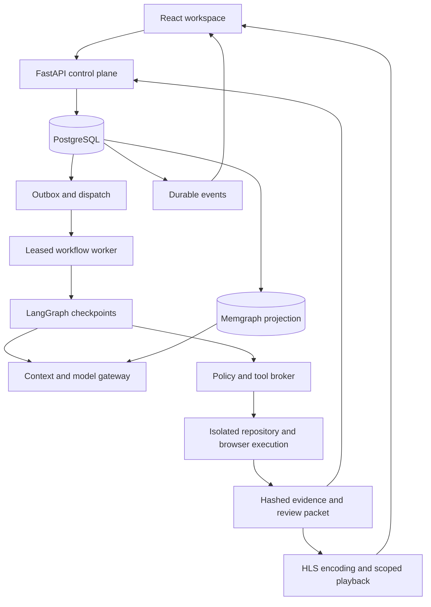
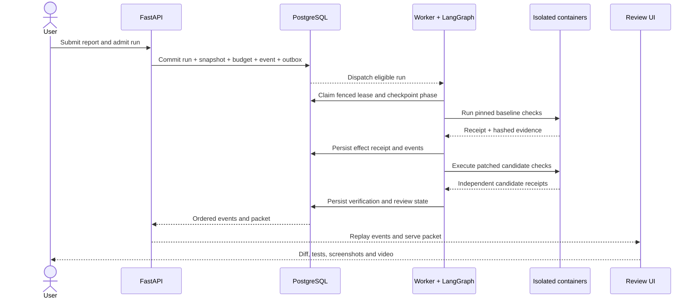
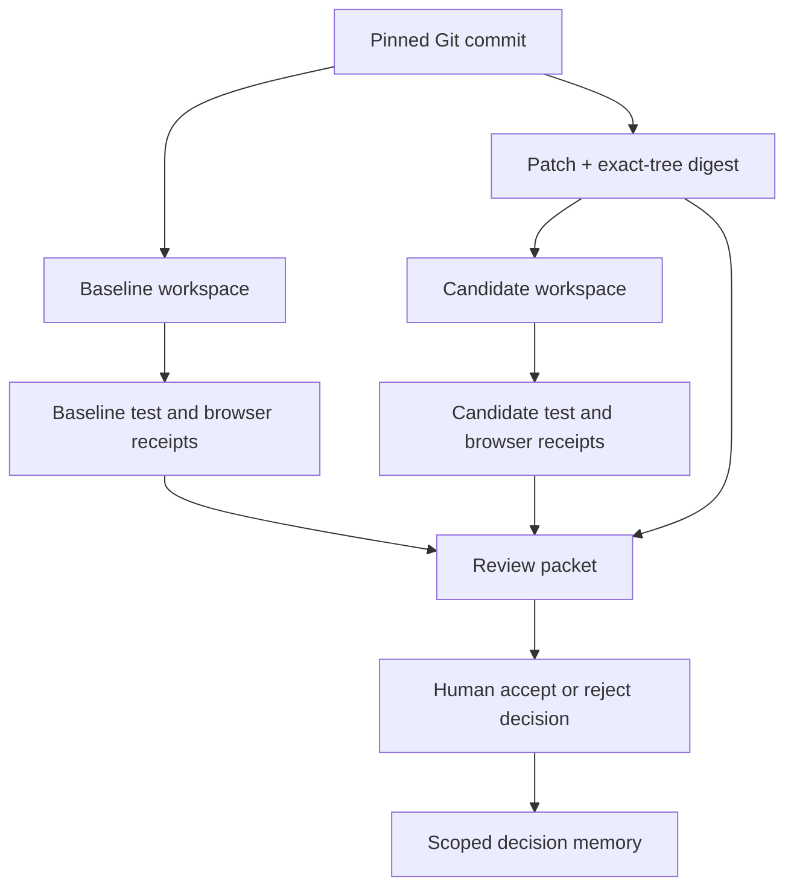

# AI Engineering Platform

**An evidence-centered engineering harness for investigating and repairing application failures.**

`FastAPI` · `PostgreSQL` · `LangGraph` · `Playwright` · `Memgraph` · `FFmpeg` · `React`

The platform connects a bug report to a pinned source revision, reproducible execution, bounded model assistance, independent verification, and a review packet. Application code owns authorization, budgets, side effects, state transitions, and the evidence trail. A result remains **inconclusive** when the evidence does not justify a repair claim.

**Design reference:** [AI Engineering Platform product requirements and architecture](AI_Engineering_Platform_PRD.md).

## The use case

Consider a report that a form does not submit correctly. A developer needs more than a suggested line of code: they need the failing behavior at a known commit, the evidence behind a proposed change, and a repeatable check of the patched tree.

| Step | What the platform records | What the reviewer receives |
|---|---|---|
| Report | Project, expected and actual behavior, reproduction data, pinned Git commit | A task with a stable source identity |
| Reproduce | Named test, browser scenario, screenshot, recording, sanitized output and hidden oracle receipt | A baseline result with linked artifacts |
| Investigate | Scoped source excerpts, code symbols, verified project memory and bounded evidence | A traceable context bundle |
| Patch | Exact-tree candidate workspace, changed files and patch digest | A unified diff tied to the source commit |
| Verify | Separate named, browser and oracle checks against the candidate | Before/after results and recordings |
| Review | Run events, verdict, patch, media, evidence ZIP and decision history | One review packet that preserves the test outcome |

The included `form-submit-001` case exercises a pinned baseline, a candidate patch, separate checks and a review packet. Its provider path uses a predetermined response for controlled protocol verification.

## The AI harness

The LLM is a bounded reasoning component inside a durable engineering system. The harness decides *when* to ask a model, *which evidence* to give it, *which tools* it may request, *how much* the call may cost, and *what must be independently checked* afterward. The model can propose a patch or a tool call; it cannot advance the run state, certify its own repair, enlarge its permissions, or publish code by writing persuasive text.

### Platform layers around the AI harness

| Layer | Responsibility in this codebase |
|---|---|
| **Frontend workspace** | Project, report, run, review, evaluation, memory, usage and operations views; progress events, approvals, diff and evidence playback. |
| **FastAPI control plane** | Identity, tenant and project authorization, task and run APIs, review actions, artifact access and replayable execution events. |
| **Model gateway** | Native provider adapters, versioned model entries, policy-aware routing, bounded failover and reported-usage accounting. |
| **Agent orchestration** | LangGraph phases and PostgreSQL checkpoints; a worker coordinates source preparation, baseline, proposal, candidate and review stages. |
| **Agent harness** | Fenced leases, run limits, effect intents and receipts, pauses, cancellation, replay and stopping conditions. |
| **Context management** | Builds provenance-labelled ContextBundles from task state, pinned code, failure evidence and verified memory. |
| **Token management** | Bounds the input envelope, output reservation, safety margin, log excerpts and compaction before a provider call. |
| **Repository retrieval** | Lists and searches pinned files, navigates symbols and records revision-specific code dependencies. |
| **Session memory and continuity** | Keeps durable run events, workflow checkpoints, context lineage and completed tool receipts for resumption. |
| **Long-term project memory** | Stores source-backed facts and reviewer decisions with scope, validity and transition history; projects relationships to Memgraph. |
| **Tool execution** | Authorizes typed actions for approved tests, browser scenarios, patch workspaces and separately approved publication. |
| **Execution isolation** | Runs source and browser checks outside FastAPI in bounded development containers; defines separate hosted guest execution contracts. |
| **Guardrails** | Enforces tenant scope, action policy, plugin manifest integrity, allowed targets, secret boundaries and approval gates in code. |
| **Independent evaluation** | Runs declared tests, browser checks and hidden oracles; scores synthetic attempts, including false-success claims. |
| **Observability** | Carries trace context and records run, model, tool, queue, media, latency, reservation and compaction signals. |
| **Persistence** | Uses PostgreSQL for canonical records and checkpoints, Memgraph as a derived retrieval projection, and hashed artifacts for evidence. |
| **Review and publication** | Keeps diff, test receipts, media and reviewer decision separate; draft-PR publication requires a distinct approval and reconciliation path. |
| **Evidence media** | Encodes recordings to HLS and serves scoped playback with deletion and private-publication records. |

### AI harness component inventory

The inventory connects the PRD's model, tool, orchestration, context, memory, execution and evaluation concepts to the backend modules that implement their contracts.

| Component | Responsibility in a run |
|---|---|
| [Workflow graph](platform_app/fixture_workflow.py) | Moves through reproduction, investigation, patching and verification with saved phase state. |
| [Run ledger](platform_app/run_ledger.py) | Stores ordered events, leases, fencing tokens and effect identity across retries. |
| [Pause integrity](platform_app/pause_integrity.py) | Keeps the resume target and completed receipts bound to the original run plan. |
| [Provider adapters](platform_app/providers.py) | Normalize native OpenAI, Anthropic and Google responses without discarding provider identity. |
| [Stream assembly](platform_app/provider_streams.py) | Waits for a complete response and validated tool arguments before authorization. |
| [Model qualification](platform_app/model_qualification.py) | Checks the exact model, adapter revision, capabilities and usage contract. |
| [Model routing](platform_app/model_routing.py) | Filters candidates by tenant policy, capability, limits and qualification evidence. |
| [Model failover](platform_app/model_failover.py) | Creates a separate lineage for an explicitly approved alternate after a definite rejection. |
| [Context bundles](platform_app/context_bundle.py) | Packages task, pinned source, test evidence and verified memory with provenance labels. |
| [Code navigation](platform_app/code_navigation.py) | Bounds file search, symbol lookup and excerpt reads against the admitted commit. |
| [Code index](platform_app/code_index.py) | Records revision-pinned files, symbols and dependency edges for retrieval. |
| [Token envelope](platform_app/token_budget.py) | Allocates input, output, overhead and safety margin before provider HTTP. |
| [Context compaction](platform_app/context_compaction.py) | Reduces oversized evidence while preserving constraints and original-artifact lineage. |
| [Model budget](platform_app/model_budget.py) | Reserves maximum call liability and settles reported usage at pinned prices. |
| [Action policy](platform_app/action_policy.py) | Checks run, tenant, target, action class and budget outside the prompt. |
| [Tool broker](platform_app/tool_broker.py) | Validates typed actions and records denials, effect intents and receipts. |
| [Plugin registry](platform_app/plugin_registry.py) | Pins reviewed manifests, digests, schemas, scopes and tenant grants. |
| [Project memory](platform_app/memory.py) | Owns fact states, source evidence, validity and transition history. |
| [Graph projection](platform_app/graph_memory.py) | Retrieves scoped relationships and rechecks them against canonical facts. |
| [Isolated execution](platform_app/dev_sandbox.py) | Runs pinned tests and candidate checks outside the control API process. |
| [Browser runner](platform_app/browser_runner.py) | Executes bounded scenarios and captures browser receipts, screenshots and recordings. |
| [Patch workspace](platform_app/patch_workspace.py) | Materializes a candidate tree and records its changed-file scope and digest. |
| [Independent verifier](platform_app/verifier.py) | Produces check results that the model's explanation cannot override. |
| [Review evidence](platform_app/evidence_bundle.py) | Joins source, patch, checks and artifact hashes into an inspectable packet. |
| [Benchmark contract](platform_app/benchmark_contract.py) | Scores complete attempts, including failures and unsupported success claims. |
| [Telemetry](platform_app/telemetry.py) | Carries run and step trace context through model, tool and media work. |

### One model step, end to end

| Stage | Harness responsibility | Persisted boundary |
|---|---|---|
| Select | Choose an enabled, capability-qualified model under tenant data policy | Model, adapter, price and policy revisions |
| Ground | Retrieve the pinned source, failing checks and current verified memory | Evidence IDs, commit and content hashes |
| Pack | Build a trust-labelled ContextBundle and bounded token envelope | Bundle hash, selected sources and compaction lineage |
| Reserve | Lock the run and tenant budget before provider HTTP | Effect intent and maximum cost liability |
| Infer | Call the native provider adapter and assemble its terminal response | Provider request, usage and continuation metadata |
| Authorize | Validate any complete tool request against the broker's contract | Decision, effect key and typed receipt |
| Verify | Test the candidate tree independently and construct the review packet | Test, browser, oracle and artifact receipts |

**Workflow ownership.** LangGraph checkpoints the phase, while PostgreSQL records the authoritative run, lease, events and effect ledger. The worker can resume from a saved stage after a pause or crash without asking the LLM to remember what already happened. Completed effects are reused only after their receipts and artifacts are checked. Uncertain external effects stop automatic replay. This is the difference between a conversational coding assistant and a recoverable agent harness. See [`fixture_workflow.py`](platform_app/fixture_workflow.py), [`hosted_worker.py`](platform_app/hosted_worker.py) and [`run_ledger.py`](platform_app/run_ledger.py).

**Model portability with preserved semantics.** OpenAI, Anthropic and Google have native adapter code behind a normalized request/response boundary. The adapters retain their own stop reasons, tool-call identifiers, usage categories and continuation data; they do not pretend that one provider's private reasoning state is interchangeable with another's. Streaming text and tool arguments are assembled into a terminal response before a tool is considered. The registry and router use exact model revisions, capability checks, tenant policy and measured route inputs, while a policy-approved provider switch creates new lineage and a new spend reservation. See [`providers.py`](platform_app/providers.py), [`provider_streams.py`](platform_app/provider_streams.py), [`model_routing.py`](platform_app/model_routing.py) and [`model_failover.py`](platform_app/model_failover.py).

**Evidence-aware context.** A ContextBundle has typed items for task constraints, pinned code, current failure evidence and selected memory. Every included item carries provenance and a trust label. The code navigator reads bounded files and symbols from the admitted commit; memory retrieval excludes stale and unverified facts. Large logs stay as complete artifacts and contribute only relevant, referenced excerpts to the prompt. Compaction records both the original and reduced context, preserving requirements and unresolved actions while lowering input size. See [`context_bundle.py`](platform_app/context_bundle.py), [`code_navigation.py`](platform_app/code_navigation.py), [`context_compaction.py`](platform_app/context_compaction.py) and [`graph_memory.py`](platform_app/graph_memory.py).

**Token and cost envelopes.** Before sending a request, the harness calculates room for serialized input, requested output, provider overhead and a safety margin against the model's verified limit. The run and tenant ledgers reserve maximum liability using the pinned price revision. Reported usage later settles the reservation; a timeout remains an uncertain liability rather than a free retry. A run-spend cap causes a durable pause, and an authorized increase can resume from the saved point. See [`token_budget.py`](platform_app/token_budget.py) and [`model_budget.py`](platform_app/model_budget.py).

**Tool use is a separate authority.** A model response may name an action and arguments, but only the broker can authorize it. The broker checks schema, tenant, project, run, target, plugin version, side-effect class and budget. It records the intent before execution and a typed receipt after execution. Partial streamed arguments, unregistered actions and prompt-injected requests cannot bypass this check. A repository file or browser page is input data even when it contains instructions addressed to the model. See [`tool_broker.py`](platform_app/tool_broker.py), [`action_policy.py`](platform_app/action_policy.py) and [`plugin_registry.py`](platform_app/plugin_registry.py).

**Memory is evidence, not chat history.** Workflow checkpoints, the conversation, and reusable project facts are stored separately. PostgreSQL owns fact status, source, validity and transition history; Memgraph projects verified relationships among revision-pinned files, symbols, decisions and incidents. Graph results are rechecked against canonical scope and freshness before entering model context. A reviewer decision remains a decision record, and a model assertion does not verify itself. See [`memory.py`](platform_app/memory.py), [`graph_memory.py`](platform_app/graph_memory.py) and [`code_index.py`](platform_app/code_index.py).

**Independent outcome.** The candidate patch is applied to a separate exact-tree workspace. Named tests, browser checks and hidden verification produce receipts independent of the model's explanation. The review packet ties those results to the diff and artifact digests. The verdict can be passed, failed or inconclusive, and reviewer acceptance is stored separately. The synthetic benchmark suite includes both bugs and reports where abstaining is the correct behavior. See [`patch_workspace.py`](platform_app/patch_workspace.py), [`verifier.py`](platform_app/verifier.py), [`evidence_bundle.py`](platform_app/evidence_bundle.py) and [`benchmark_contract.py`](platform_app/benchmark_contract.py).

## Backend architecture

### 1. Request, execution and evidence planes

PostgreSQL owns run state and provenance. The graph is a scoped retrieval projection. Dispatch wakes work; a database lease and fencing token decide which worker may change a run. Media completion is tracked separately from code verification.

### 2. Durable run lifecycle

The workflow is `PREPARING → REPRODUCING → INVESTIGATING → PATCHING → VERIFYING → REVIEW_READY`. It also records controlled pauses, cancellation, failure and inconclusive outcomes. A resumed run restores its saved stage before LangGraph continues from its durable PostgreSQL checkpoint. Completed effects are checked against their stored receipts; an uncertain effect stops replay for reconciliation.

### 3. Why a verdict is traceable

The reviewer decision is stored separately from the independent verification verdict. Accepting a packet does not change a failed test into a pass.

## Backend design, from admission to review

### Transactional admission and canonical data

Run creation is one database transaction. The request's idempotency key binds a task and run to a frozen Git commit, policy, model revision, spending boundary, initial event and dispatch outbox row. Repeated admission can return the same run rather than launch duplicate work. PostgreSQL stores the canonical relationships among tenants, projects, tasks, runs, events, tool actions, artifacts, reservations and reviewer decisions. Alembic migrations version that schema.

The queue is a wake-up mechanism. Delivery can repeat; a database lease and fencing token decide which worker can advance a run. Per-run event sequences and effect keys preserve ordering across retries. A committed outbox row records the decision to dispatch before transport delivery. See [`service.py`](platform_app/service.py), [`run_ledger.py`](platform_app/run_ledger.py), [`models.py`](platform_app/models.py) and [`queue_dispatch.py`](platform_app/queue_dispatch.py).

### Identity, tenancy and capability boundaries

The API scopes reads and writes by tenant, project membership and role. Bearer identity and the browser OIDC authorization-code path are separate entry points; browser sessions use PKCE, server-side state, origin and CSRF checks. Event streams recheck membership during delivery, so an open connection does not retain access indefinitely. Artifact downloads, memory, model policy, plugin grants and owner operations inherit the same scope.

Repository comments, browser pages, tool results and model output are treated as untrusted data. They cannot grant a new capability. Policy decisions are made in application code against tenant, project, run, policy revision, action class, target and budget; sensitive changes are audited without storing secret values. See [`auth.py`](platform_app/auth.py), [`browser_auth.py`](platform_app/browser_auth.py), [`tenant_admin.py`](platform_app/tenant_admin.py) and [`action_policy.py`](platform_app/action_policy.py).

### Durable orchestration and effect reconciliation

LangGraph carries workflow phases and PostgreSQL stores checkpoints. A worker claims a fenced lease, heartbeats it and persists the current stage. The development workflow and hosted coordinator join pinned source preparation, baseline checks, investigation, bounded model proposal, candidate checks and review-packet creation. Active time, tool calls, model calls, patch attempts and infrastructure retries are bounded. Repeated candidate trees are stopped rather than cycled indefinitely.

Every external effect has a persisted **intent before execution** and a **receipt after execution**. Recovery validates stored receipts and artifact hashes before reusing work. An uncertain provider request or publication outcome is held for reconciliation instead of blindly repeated. A pause stores its resume stage and completed effects; cancellation fences the worker and retains partial evidence. See [`fixture_workflow.py`](platform_app/fixture_workflow.py), [`development_worker.py`](platform_app/development_worker.py), [`hosted_worker.py`](platform_app/hosted_worker.py), [`pause_integrity.py`](platform_app/pause_integrity.py) and [`tool_broker.py`](platform_app/tool_broker.py).

### Native provider adapters and model lifecycle

The model gateway contains native OpenAI, Anthropic and Google adapters. Their complete and streamed response paths normalize text, tool calls, stop reasons, continuation references and reported usage while preserving provider-specific boundaries. Streamed tool arguments are assembled, parsed and schema-checked before a tool can run; a partial stream grants no authority. The gateway classifies authentication, access, rate, timeout, overload, refusal, context and schema outcomes without exposing raw provider bodies.

The versioned registry pins provider/API family, exact model revision, verified limits, capabilities, adapter digest and price rules. Models move through registered, validating, qualified, enabled, deprecated and disabled states. Admission checks the exact pinned entry. Automatic routing first filters by tenant data policy, capability, context and output limits, availability and recorded qualification, then compares utility, latency and cost. A cross-provider alternate needs a tenant-approved exact route; a definite rejected source call gets a new lineage and reservation. See [`providers.py`](platform_app/providers.py), [`provider_streams.py`](platform_app/provider_streams.py), [`model_qualification.py`](platform_app/model_qualification.py), [`model_routing.py`](platform_app/model_routing.py) and [`model_failover.py`](platform_app/model_failover.py).

### Context engineering and token control

Each model request receives a versioned **ContextBundle** with task constraints, run state, selected source excerpts, current failure evidence and relevant verified memory. Items carry source locators, trust labels, versions and hashes. Repository context is tied to the admitted commit and file digest. The code index bounds file listing, text search, Python and JS/TS symbols, excerpt reads and dependency traversal before content enters the prompt.

Before provider HTTP, the token envelope accounts for the verified model limit, application cap, requested generation, provider overhead and safety margin. Large logs remain complete, digest-checked artifacts; the prompt receives bounded excerpts and references. Compaction near the input allocation preserves constraints, source identity, test outcomes, unresolved effects, failed attempts and original-artifact pointers. The summary and source are content-addressed for replay. Essential source that cannot fit causes a closed failure rather than silent omission. See [`context_bundle.py`](platform_app/context_bundle.py), [`context_compaction.py`](platform_app/context_compaction.py), [`token_budget.py`](platform_app/token_budget.py), [`code_navigation.py`](platform_app/code_navigation.py) and [`code_index.py`](platform_app/code_index.py).

### Model spending and resource quotas

The gateway reserves the upper-bound call cost **before** provider HTTP. Settlement uses reported usage and the run's frozen price revision, including separate uncached input, cache read, cache write and output categories when applicable. Reservations use tenant locking. A definite rejection can release liability with a receipt; an uncertain request keeps liability until reconciliation. An exhausted run enters a durable budget pause that requires bounded owner approval to resume.

Independent ledgers cover daily and monthly inference, concurrent runs, sandbox minutes, media input minutes, evidence export bytes and private HLS bytes. New reservations are blocked at the authorized cap. Sandbox time settles after confirmed guest termination; private media storage charges release after verified deletion. See [`model_budget.py`](platform_app/model_budget.py), [`tenant_quota.py`](platform_app/tenant_quota.py), [`sandbox_quota.py`](platform_app/sandbox_quota.py), [`media_quota.py`](platform_app/media_quota.py), [`artifact_quota.py`](platform_app/artifact_quota.py) and [`export_quota.py`](platform_app/export_quota.py).

### Tool contracts and plugin governance

Versioned action contracts define schemas, permission scopes, target restrictions, side-effect class, runtime and output limits. The broker checks every action against run and tenant policy. A denial is a typed result and durable event. Successful results retain structured fields, sanitized summary, duration, byte count, truncation status and artifact/effect receipt. Full logs are served through run-scoped, hash-verified downloads instead of being copied wholesale into model context.

The plugin registry validates identity, publisher, exact version, artifact digest, transport, reviewed JSON schemas, allowed destinations, credential types and compatibility. A tenant owner can grant an intact enabled version. Remote MCP origins are restricted to reviewed public HTTPS endpoints; a remote version cannot be enabled without transport qualification. Tool discovery or tool text cannot expand the broker's authority. See [`tool_broker.py`](platform_app/tool_broker.py), [`action_policy.py`](platform_app/action_policy.py) and [`plugin_registry.py`](platform_app/plugin_registry.py).

### Pinned repositories and isolated execution

An exact Git commit is archived and validated before it becomes a workspace. Baseline and candidate workspaces are distinct: the candidate starts from the same source plus the recorded patch. Named tests, browser scenarios and hidden verification therefore compare concrete trees rather than a model's description of its edit.

The exercised development path uses bounded WSL containers with non-root execution, read-only and capability limits, and network restrictions. Hosted integration modules define private guest networking, per-run EC2 launch intent, scoped S3 input/output transport, guest bootstrap, fenced result receipts and termination reconciliation. Separate baseline and candidate guest generations prevent one phase from inheriting the other's mutable workspace. See [`repository_archive.py`](platform_app/repository_archive.py), [`dev_sandbox.py`](platform_app/dev_sandbox.py), [`sandbox_broker.py`](platform_app/sandbox_broker.py), [`sandbox_transport.py`](platform_app/sandbox_transport.py), [`guest_runner.py`](platform_app/guest_runner.py) and [`infra/`](infra).

### Browser reproduction and evidence integrity

Playwright executes declared interactions against an allowed origin, captures screenshots and recordings, and returns bounded DOM and event evidence. The browser path blocks cross-origin requests, service workers, popups and downloads. Browser and test effects produce receipts with status, byte counts and SHA-256 digests; replay rejects altered logs or recordings. Hidden-oracle checks remain separate from the proposed patch's view.

The evidence bundle joins source commit, environment manifest, baseline and candidate receipts, artifact hashes, patch identity and review metadata. A failed or unexecuted check cannot become a successful verification through model prose or reviewer acceptance. See [`browser_runner.py`](platform_app/browser_runner.py), [`environment_manifest.py`](platform_app/environment_manifest.py), [`verifier.py`](platform_app/verifier.py), [`evidence_bundle.py`](platform_app/evidence_bundle.py) and [`sandbox_evidence.py`](platform_app/sandbox_evidence.py).

### Patch review and publication boundary

Patch materialization records changed-file scope and an exact-tree digest. The review packet connects the unified diff to baseline and candidate checks, screenshots, recordings and independent verdict. A reviewer decision is a separate record about that packet. Repository publication is separately privileged: the GitHub integration stores a project-scoped connection, qualifies read-only access, requires explicit draft-PR approval and dispatches publication durably. On retry it reconciles the expected branch and PR marker before another external request. See [`patch_workspace.py`](platform_app/patch_workspace.py), [`review_patch.py`](platform_app/review_patch.py), [`repository_connections.py`](platform_app/repository_connections.py), [`github_publication.py`](platform_app/github_publication.py) and [`publication_dispatch.py`](platform_app/publication_dispatch.py).

### Canonical memory and graph retrieval

Workflow checkpoints, project knowledge and graph indexes serve different purposes. PostgreSQL owns memory facts with tenant/project scope, source evidence, revision validity, actor, reason and transition history. Facts can be proposed, verified, superseded, rejected or deleted. Reviewer outcomes are labelled decisions, not automatically proof of repair correctness.

An outbox projects verified facts and revision-pinned file/symbol dependencies to Memgraph. Retrieval restricts project, commit, status, freshness and traversal depth, then rechecks graph hints against canonical rows. A stale or unavailable graph falls back to scoped PostgreSQL lookup. Model context receives a bounded set of current, source-backed facts; unverified or superseded claims are excluded. See [`memory.py`](platform_app/memory.py), [`graph_memory.py`](platform_app/graph_memory.py) and [`code_index.py`](platform_app/code_index.py).

### Durable API events and review surfaces

Each run event has a unique event ID, per-run sequence, timestamp, trace ID, type and versioned payload. Server-sent events replay after a cursor and then deliver new committed events. PostgreSQL notifications wake active streams; polling covers notification loss. Identity and membership are rechecked during delivery. The React workspace reads persisted Projects, Reports, Runs, Review, Evaluations, Memory, Usage, Settings and Operations records rather than inferring state from chat text. See [`api.py`](platform_app/api.py), [`schemas.py`](platform_app/schemas.py), [`event_signal.py`](platform_app/event_signal.py) and [`apps/web/`](apps/web).

### Adaptive media and private artifacts

FFmpeg converts browser recordings into digest-checked HLS playlists and segments. Baseline and candidate media are tracked separately. Encoding has its own status, queue and reservation path: a delayed recording does not change code verification, and tests and screenshots remain reviewable. Local playback requires project/run authorization.

Private-media modules define scoped S3 publication, signed playback grants, deletion tombstones, object removal and CloudFront invalidation. Access revokes when deletion begins; a remote deletion remains pending until its object and cache receipts verify. See [`media.py`](platform_app/media.py), [`hosted_media.py`](platform_app/hosted_media.py), [`hosted_media_worker.py`](platform_app/hosted_media_worker.py), [`private_media.py`](platform_app/private_media.py) and [`private_media_deletion.py`](platform_app/private_media_deletion.py).

### Observability, operations and evaluation

Trace context follows admission, outbox dispatch, workflow execution, model calls, tool effects, context construction and media work. Structured telemetry links run and step to policy, model, attempt, outcome and duration without making raw prompts or secrets default span attributes. Operations reads canonical run state, queue and graph age, model outcomes, reservations, tool failures, media jobs, expired leases and durable alerts. Alert rules have owners, runbooks, repeated-sample thresholds and signed webhook delivery records.

The evaluation package holds forty pinned synthetic cases covering browser-reproducible bugs and non-bug or underspecified reports. Cases record source/environment identity, baseline expectations and hidden oracles. Scoring counts every attempt and flags unsupported success claims. The unit of evaluation is the whole repair protocol—reproduction, verification, abstention, authorization and cost—not merely the appearance of a generated patch. See [`telemetry.py`](platform_app/telemetry.py), [`operations.py`](platform_app/operations.py), [`operational_alerts.py`](platform_app/operational_alerts.py), [`benchmark_contract.py`](platform_app/benchmark_contract.py), [`fixture_evaluation.py`](platform_app/fixture_evaluation.py) and [`benchmarks/`](benchmarks).

### Infrastructure separation and recovery

The repository defines separate control-plane, sandbox-guest and media-worker images. Terraform modules describe the trusted API/worker network, private guest network without general outbound NAT, queue, database, object storage, and edge resources. A Packer definition pins the guest image inputs. Dispatch, guest output transport and media encoding use different identities and artifact scopes, keeping untrusted repository execution outside the API process.

Readiness checks distinguish API liveness from database availability. A database fault prevents new authoritative mutations; graph retrieval can fall back to scoped canonical rows; media failure leaves non-video review evidence available. Recovery paths reconcile expired leases, durable outbox rows, guest termination, publication markers and deletion tombstones before replay. See [`config.py`](platform_app/config.py), [`queue_consumer.py`](platform_app/queue_consumer.py), [`sandbox_broker.py`](platform_app/sandbox_broker.py), [`media_queue.py`](platform_app/media_queue.py), [`infra/control-plane/`](infra/control-plane), [`infra/media-worker/`](infra/media-worker) and [`infra/terraform/`](infra/terraform).

### Security and data governance

The trust boundary covers report text, source files, dependency scripts, browser pages, plugin metadata, tool output and model-generated arguments. The broker evaluates permissions independently of that content. Source archives use bounded extraction; isolated execution limits host and network access; browser navigation enforces the allowed origin. Provider keys remain in the worker environment, and publication uses a separately authorized repository connection.

Artifact reads use tenant/project/run scope and digest checks. Memory deletion produces a canonical tombstone before graph projection; recording deletion revokes access and removes local raw/HLS artifacts. Private publication and deletion track remote object and cache receipts. Audit records identify actor, action, target, policy and outcome without making raw secrets part of the review trail. See [`safe_archive.py`](platform_app/safe_archive.py), [`action_policy.py`](platform_app/action_policy.py), [`recording_deletion.py`](platform_app/recording_deletion.py), [`private_media_deletion.py`](platform_app/private_media_deletion.py) and [`memory.py`](platform_app/memory.py).

## Workspace and API

The React workspace contains Projects, Reports, Runs, Review, Evaluations, Memory, Usage, Settings and Operations views. It reads real API records and uses the durable event stream to update a run. Review exposes the diff, tests, screenshots, evidence download and HLS player. Project, report and run dialogs manage keyboard focus and restore it on close.

| API area | Representative routes |
|---|---|
| Projects and reports | `GET/POST /v1/projects`, `GET/POST /v1/tasks` |
| Runs | `POST /v1/tasks/{task_id}/runs`, `GET /v1/runs/{run_id}`, `POST /v1/runs/{run_id}/cancel` |
| Recovery and review | `POST /v1/runs/{run_id}/resume`, `/resume-budget`, `/review-decision` |
| Progress | `GET /v1/runs/{run_id}/events`, `/events/history` |
| Evidence | `GET /v1/runs/{run_id}/review-packet`, `/patch`, `/evidence-bundle` |
| Memory and operations | `GET /v1/projects/{project_id}/memory`, `/code-index`, `GET /v1/operations/summary` |
| Service checks | `GET /v1/health`, `GET /v1/ready` |

FastAPI exposes the complete route schema at `/docs` in local development.
